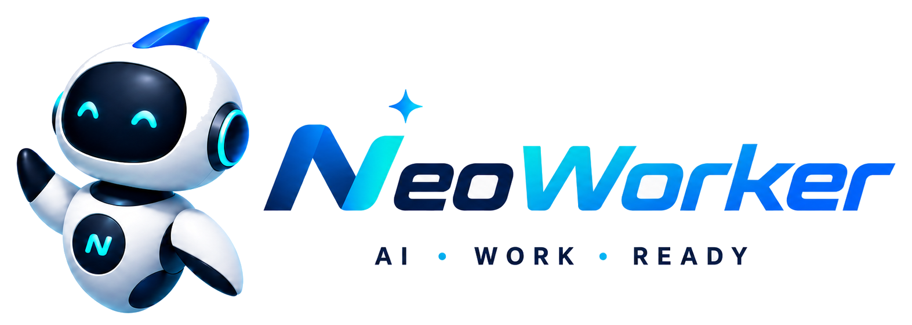
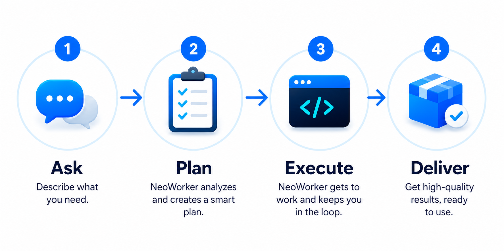
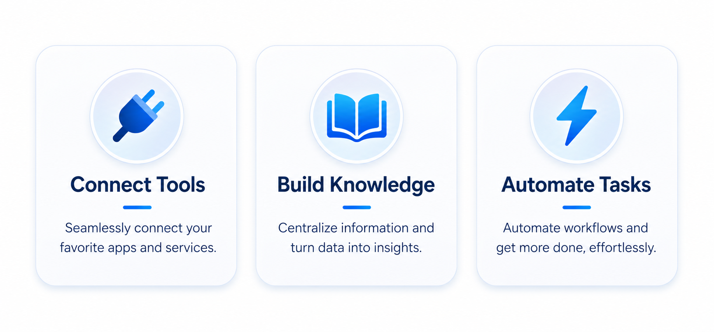
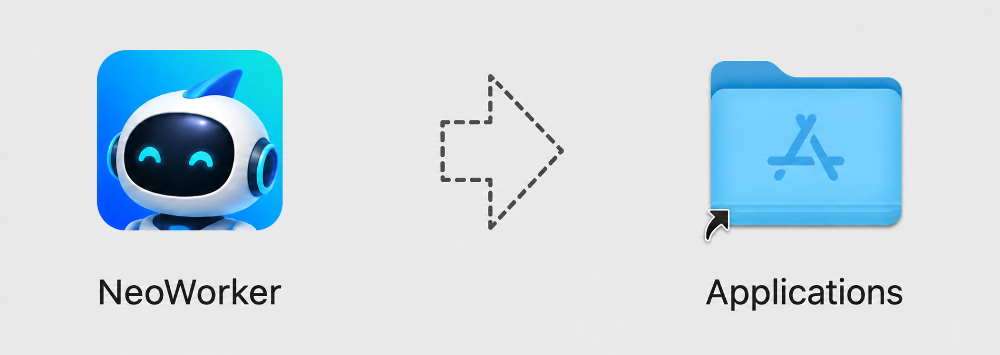
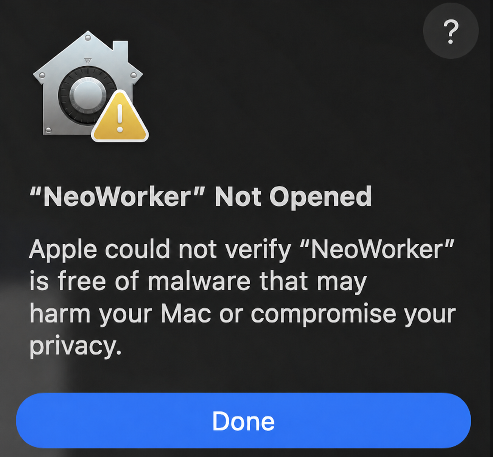
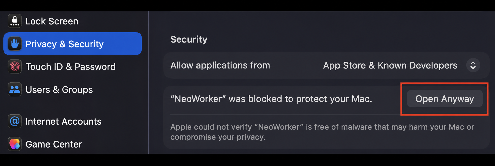
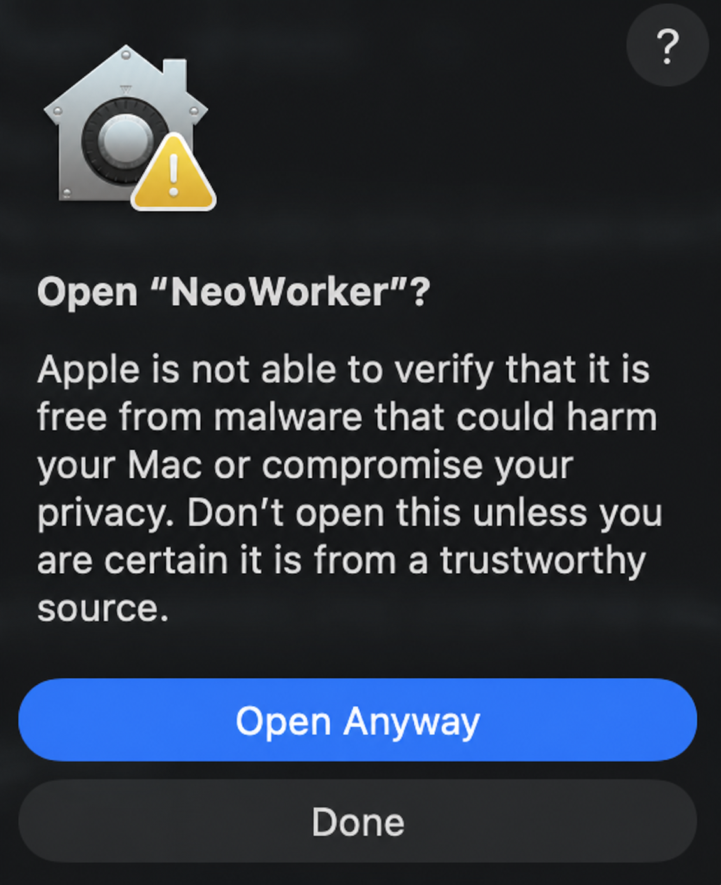

  <strong>English</strong> | <a href="./docs/README.zh-CN.md">简体中文</a>

  

<h1 align="center">NeoWorker</h1>

  <strong>A GUI-first, CLI-ready, local-first AI work operating system.</strong> 
  NeoWorker goes beyond answering questions: it understands context, uses tools, advances tasks, and delivers real files you can open, edit, and trace.

  
  
  
  = 24">
  

  <a href="#what-is-neoworker">Overview</a>
  &nbsp;·&nbsp;
  <a href="#how-neoworker-works">How it works</a>
  &nbsp;·&nbsp;
  <a href="#quick-start">Quick start</a>
  &nbsp;·&nbsp;
  <a href="#what-neoworker-can-do">Capabilities</a>
  &nbsp;·&nbsp;
  <a href="./docs/features.md">Full feature set</a>
  &nbsp;·&nbsp;
  <a href="./docs/architecture.md">Architecture</a>
  &nbsp;·&nbsp;
  <a href="./docs/SECURITY.md">Security</a>
  &nbsp;·&nbsp;
  <a href="./docs/CONTRIBUTING.md">Contributing</a>

## What is NeoWorker?

NeoWorker is an **open-source desktop AI work operating system** for individuals and small teams. It brings conversations, project context, local files, models, tools, Skills, automations, and multi-agent collaboration into one workspace. Start with a natural-language objective and move through understanding, planning, tool use, execution, and delivery without losing context.

NeoWorker is not a chatbot that only produces text. Inside a permission-controlled runtime, it can work with files, terminals, browsers, and Office documents; conduct research; write and analyze; modify code; and run repeatable workflows. Results are delivered as real DOCX, XLSX, PPTX, PDF, HTML, image, Markdown, or code files that remain available for further editing.

The system is local-first, model-flexible, and extensible. Workspaces, task history, and artifacts stay on your machine. You can connect different model providers and add specialized capabilities through Skills and MCP Connectors. Execution steps, approvals, retries, failures, and final outputs remain inspectable so work can be reviewed, recovered, and continued.

## How NeoWorker works

  
   <em>Describe the goal. NeoWorker plans the work, executes it, and delivers results you can keep using.</em>

Provide a goal, the available material, and the expected deliverable. NeoWorker uses the current workspace as context, creates an execution plan, selects the appropriate model, tools, and Skills, requests permission when needed, and validates the result before delivery.

## Why NeoWorker?

- **One application for complete work** — research, writing, data analysis, coding, browser operations, Office files, automations, and messaging workflows live in the same task workspace.
- **GUI-first, CLI-ready** — the desktop app handles conversations, files, approvals, and visual execution; the <code>neoworker</code> CLI uses the same local runtime, models, Skills, and workspaces.
- **Tasks, not isolated chats** — agents can plan, call tools, handle failures, wait for approval, resume execution, and preserve the entire process on a task timeline.
- **Deliverable-first** — DOCX, XLSX, PPTX, PDF, HTML, Markdown, images, and code are first-class outputs rather than a message claiming a file was created.
- **Artifacts remain editable** — outputs stay linked to their tasks and can be previewed, downloaded, opened, and revised.
- **Flexible models and tools** — combine multiple providers, OpenAI-compatible endpoints, Skills, MCP Connectors, and local tools.
- **Built for long-running work** — projects, workspaces, memory, agent teams, and automations turn one-off conversations into sustainable workflows.
- **Governed high-privilege actions** — file writes, Shell commands, browser control, and external app operations remain subject to workspace boundaries, permission modes, and approval policies.

  
   <em>Connect tools, build knowledge, and automate tasks from a single workbench.</em>

## Project direction

NeoWorker focuses on turning AI from a conversational assistant into a personal work system that can continuously understand context, execute tasks, and deliver usable results.

| Direction | Focus |
| --- | --- |
| **Chinese-first product experience** | Better Chinese UI copy, terminology, onboarding, model access, and commonly used regional messaging channels. |
| **Lower learning curve** | Automatically infer whether a task needs execution, research, or a Skill instead of requiring users to choose a mode first. |
| **Reliable file delivery** | Strengthen generation, discovery, preview, download, opening, and integrity checks for Office, PDF, and HTML artifacts. |
| **Transparent execution** | Make plans, tool calls, failures, retries, approvals, and final outputs easy to inspect. |
| **Portable extensions** | Keep Skills and tools portable across NeoWorker and compatible agent environments. |
| **Local work center** | Keep workspaces and runtime records on the local machine while allowing opt-in cloud models and external services. |

## Current version

The current public version is **<code>v0.1.2</code>** (package version <code>0.1.2</code>). The GitHub Release includes:

- a macOS Apple Silicon <code>.dmg</code> package
- a Windows <code>.exe</code> installer
- release notes and checksums

See the [changelog](./docs/CHANGELOG.md) for version history.

## Quick start

### Download the desktop application

Download NeoWorker only from the official [GitHub Releases](https://github.com/Yuan-lab-LLM/NeoWorker/releases/latest) page.

| Platform | Package | Installation |
| --- | --- | --- |
| **macOS (Apple Silicon)** | <code>NeoWorker-0.1.2-arm64.dmg</code> | Open the disk image and drag NeoWorker into Applications. |
| **Windows (x64)** | <code>NeoWorker-0.1.2-windows-x64-setup.exe</code> | Run the installer and follow the setup prompts. |
| **Checksums** | <code>latest-mac.yml</code> / <code>latest.yml</code> | Verify the downloaded installer before opening it. |

#### Verify the download

Download the checksum manifest from the same Release, calculate the installer checksum locally, and compare the two values before opening the package.

On macOS:

~~~bash
shasum -a 256 NeoWorker-0.1.2-arm64.dmg
~~~

On Windows PowerShell:

~~~powershell
Get-FileHash .\NeoWorker-0.1.2-windows-x64-setup.exe -Algorithm SHA256
~~~

#### Install on macOS

NeoWorker v0.1.2 for macOS is an unsigned Apple Silicon build. The first launch may therefore need a one-time Gatekeeper approval for this app.

1. Download <code>NeoWorker-0.1.2-arm64.dmg</code> from the official [NeoWorker Releases](https://github.com/Yuan-lab-LLM/NeoWorker/releases/latest) page.
2. Open the downloaded disk image, then drag **NeoWorker** into **Applications**.

   

     
      
     Real NeoWorker disk-image window: drag NeoWorker into Applications.
   

3. Open **Applications** in Finder and double-click **NeoWorker**. If it opens, installation is complete.
4. If macOS displays **“NeoWorker” Not Opened**, click **Done**. Do not delete the app yet.

   

     
      
     macOS interface example; wording may vary by system version.
   

5. Open **Apple menu → System Settings → Privacy & Security**, scroll to **Security**, confirm that the blocked app is **NeoWorker**, and click **Open Anyway**.

   

     
      
     Open Anyway creates a one-app exception for NeoWorker.
   

6. In the confirmation dialog, click **Open Anyway** again. Enter your Mac login password or use Touch ID if requested.

   

     
      
     Confirm only when the installer came from the official NeoWorker Release.
   

After this one-time confirmation, macOS saves NeoWorker as an app-specific exception and it can be opened normally. Apple notes that **Open Anyway** is normally available for about one hour after the blocked launch attempt.

If **Open Anyway** does not appear, and you downloaded NeoWorker from the official Releases page and verified its checksum, use this app-specific fallback in Terminal:

~~~bash
sudo xattr -rd com.apple.quarantine "/Applications/NeoWorker.app"
open "/Applications/NeoWorker.app"
~~~

This command removes the download quarantine attribute only from the installed NeoWorker app. It does not disable Gatekeeper system-wide. See [Apple: Open apps safely on your Mac](https://support.apple.com/102445) for the official **Open Anyway** workflow.

If macOS says NeoWorker **will damage your computer**, do not bypass that warning. Delete the package, download it again from the official Releases page, verify the published checksum, and file an Issue with the NeoWorker version, macOS version, and full alert text if the warning remains.

#### Install on Windows

1. Download <code>NeoWorker-0.1.2-windows-x64-setup.exe</code> from the official [NeoWorker Releases](https://github.com/Yuan-lab-LLM/NeoWorker/releases/latest) page.
2. Double-click the installer and follow the setup prompts.
3. If Windows SmartScreen displays **Windows protected your PC**, confirm that the file name is the NeoWorker installer from this Release, click **More info**, then click **Run anyway**.
4. Finish setup and launch **NeoWorker** from the Start menu or desktop shortcut.

On first launch, open **Settings → AI & Models**, connect a model provider, test the connection, and select a default model. NeoWorker does not include an API Key in either installer.

### Run from source

Requirements: Node.js 24+, npm, and Git.

~~~bash
git clone https://github.com/Yuan-lab-LLM/NeoWorker.git
cd NeoWorker
npm install
npm run dev
~~~

<code>npm run dev</code> starts the Vite development server and the Electron desktop application.

### Use the CLI

~~~bash
npm run build:cli
node bin/neoworker-cli.js --help
node bin/neoworker-cli.js run "Summarize this workspace and list the three most important issues."
~~~

The CLI and desktop app share local configuration, model routing, workspaces, Skills, and MCP settings. A remote control plane is only required when remote mode is explicitly enabled.

### First launch

1. Open **Settings → AI & Models** and connect a model provider or an OpenAI-compatible endpoint.
2. Test the connection and select a default model.
3. Choose a workspace folder, or start with a temporary workspace.
4. Create a task and describe the goal, available material, and expected deliverable.
5. Review permission requests before allowing sensitive writes, Shell commands, or external application control.

> [!IMPORTANT]
> Never commit API keys, access tokens, or private configuration. Remove personal data and credentials before sharing screenshots, logs, or task history.

## What NeoWorker can do

### Agent Runtime

- Long-running task execution, dynamic planning, and failure recovery
- Session-level state, checklists, permissions, and recovery snapshots
- Parallel reads with serialized conflicting writes
- Agent teams, role assignment, and project context
- Model routing, fallback models, and multi-model collaboration
- Visible plans, tool calls, retries, and completion states

### Everything Workbench

NeoWorker treats generated files as formal task outcomes. New files enter a unified artifact workbench instead of appearing only as filenames in a response.

| Artifact | Supported workflow |
| --- | --- |
| **Word / DOCX** | Generate, preview, edit, save, download, open externally, and request revisions. |
| **Excel / XLSX / CSV** | Preview and edit tables, copy data, save changes, continue analysis, and create new versions. |
| **PowerPoint / PPTX** | Browse thumbnails, change slides, zoom, inspect notes, render previews, and continue editing. |
| **PDF** | Preview pages, extract text, inspect OCR status, ask questions, and perform visual checks. |
| **HTML / Web** | Preview in a sandbox, refresh, open in an external browser, and detect build output. |
| **Markdown / Code / JSON** | Display syntax, copy content, open externally, reveal in a folder, and revise. |

### Research, web, and knowledge work

- Search, open, and cross-check web information
- Read PDFs, documents, spreadsheets, images, and workspace material
- Interact with and verify real pages in the Browser Workbench
- Produce sourced reports, spreadsheets, presentations, and web pages
- Build project knowledge bases and maintainable research collections

### Developer workbench

- Read and modify codebases
- Run Shell commands, tests, builds, and diagnostics
- Use PTY terminal tabs for interactive command-line programs
- Verify front-end pages and responsive layouts in the built-in browser
- Keep code, terminals, browser state, task history, and approvals together

### Models, Skills, and Connectors

- Multiple model providers and OpenAI-compatible endpoints
- Model lists, defaults, fallback routing, and connection testing
- Built-in Skills, external Skill directories, and skill routing
- MCP Connectors and local tool extensions
- Skills augment the original task instead of replacing the user's goal

### Automation and messaging

- Scheduled tasks, webhooks, event triggers, and persistent workflows
- Preserved state, results, and failure reasons for every run
- Human approval when required instead of indefinite background waiting
- WeChat, WeCom, DingTalk, Feishu/Lark, and other messaging channels
- Workspace, agent-role, and tool-permission boundaries for channel tasks

### Projects, memory, and agent teams

- Workspace-level context and a local <code>.neoworker/</code> Workspace Kit
- Project goals, files, recent work, and task relationships
- Local memory, reviewable memory writes, and privacy controls
- Reusable managed agents, role profiles, and team collaboration
- Traceable relationships across automations, projects, and sessions

## Tasks to try

~~~text
Find out why this codebase fails to start, fix the problem, run the tests, and explain the scope of the changes.

Read the research material in this folder and create a sourced Word report with data tables.

Compare three vendors and deliver an Excel comparison plus an executive PowerPoint presentation.

Open the local website and test its primary flows at desktop, tablet, and phone sizes.

Check project progress every weekday morning and notify me only when you find a blocker or risk.
~~~

## Runtime model

The Electron desktop application and CLI share the same local Agent Runtime. Models handle understanding and decisions; the runtime manages session state, tool scheduling, permissions, failure recovery, and result archiving.

- **Models do not receive unlimited permissions** — available tools are filtered through operating mode, workspace, and permission policies.
- **Reads and writes are scheduled separately** — safe reads can run in parallel while conflicting writes remain serialized and ordered.
- **Artifacts belong to tasks** — files stay associated with the sessions that produced them for preview, revision, and traceability.
- **Local-first does not mean fully offline** — cloud models, web search, and external connectors remain subject to their providers' data policies.

## Project structure

~~~text
NeoWorker/
├── src/electron/      # Electron main process, Agent Runtime, tools, and local services
├── src/renderer/      # React desktop interface
├── src/shared/        # Types and protocols shared by main and renderer processes
├── src/cli/           # NeoWorker CLI
├── resources/skills/  # Built-in Skills
├── connectors/        # MCP Connectors
├── scripts/           # Build, packaging, and quality scripts
├── docs/              # Product and technical documentation
└── build/             # Application icons and packaging resources
~~~

## Development and build

| Command | Purpose |
| --- | --- |
| <code>npm run dev</code> | Start Electron and Vite in development mode. |
| <code>npm run type-check</code> | Run TypeScript type checking. |
| <code>npm test</code> | Run the Vitest test suite. |
| <code>npm run build</code> | Build the renderer, Electron, daemon, and CLI. |
| <code>npm run build:cli</code> | Build the CLI only. |
| <code>npm run office:release-gate</code> | Run the Office artifact release gate. |
| <code>npm run skills:validate-routing</code> | Validate Skill routing. |
| <code>npm run skills:validate-content</code> | Validate Skill content. |
| <code>npm run package:mac:unsigned</code> | Build an unsigned macOS package for local testing. |
| <code>npm run package:mac</code> | Build a signed macOS release using the configured signing environment. |

Before submitting code, run at least:

~~~bash
npm run type-check
npm test
~~~

## Security and privacy

- Task history, workspace indexes, and local memory are stored locally by default.
- API keys and sensitive settings use secure system storage and encrypted configuration.
- File, Shell, browser, and external app operations are governed by workspace boundaries, permission modes, and approval policies.
- Untrusted web pages and documents are treated as data sources, not instructions that can override the user's objective.
- Before enabling full access, verify the task source, execution scope, and expected write locations.
- When calling third-party models, search providers, or connectors, review their privacy and retention policies.

Do not report security vulnerabilities through a public Issue. Use the repository's **Security Advisory** feature and see the [security policy](./docs/SECURITY.md).

## Documentation

| Using NeoWorker | Development and extension |
| --- | --- |
| [Getting Started](./docs/getting-started.md) | [System architecture](./docs/architecture.md) |
| [Feature overview](./docs/features.md) | [Development guide](./docs/development.md) |
| [Everything Workbench](./docs/everything-workbench.md) | [Model providers](./docs/providers.md) |
| [Task automation](./docs/task-automations.md) | [Permission system](./docs/permission-system.md) |
| [Messaging channels](./docs/channels.md) | [NeoWorker CLI](./docs/cli.md) |

See the [changelog](./docs/CHANGELOG.md) for version history.

## Contributing

Bug reports, documentation improvements, and feature contributions are welcome. Please read:

- [Contributing guide](./docs/CONTRIBUTING.md)
- [Code of Conduct](./docs/CODE_OF_CONDUCT.md)
- [Security policy](./docs/SECURITY.md)

For substantial changes, open an Issue first and describe the problem, use case, expected behavior, and validation approach before submitting a Pull Request.

## License

NeoWorker is released under the [MIT License](./LICENSE).

---

  <strong>NeoWorker</strong> 
  AI · Work · Ready

