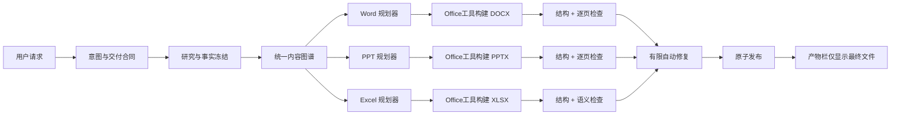
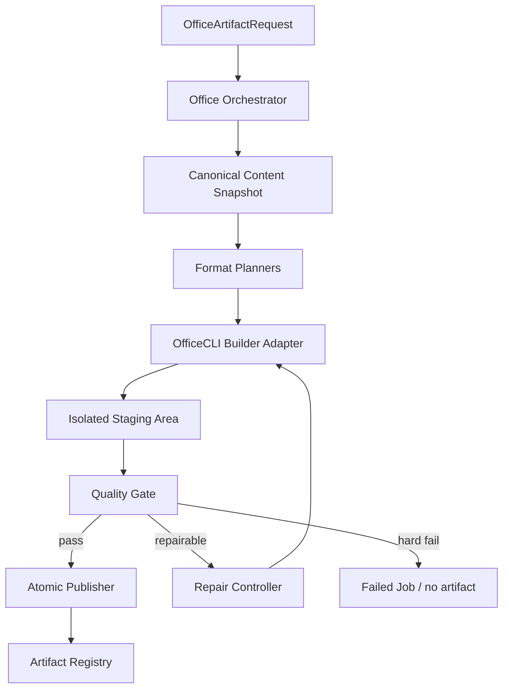

# NeoWorker Office 产物交付系统 PRD

| 字段 | 内容 |
| --- | --- |
| 文档状态 | Ready for product / engineering / design review |
| 版本 | v1.0 |
| 日期 | 2026-08-14 |
| 适用版本 | NeoWorker 0.6.x+ |
| 目标读者 | 产品、设计、Agent Runtime、Electron、Renderer、Office 工具、QA、发布工程 |
| 产品范围 | Word、PowerPoint、Excel 的规划、生成、检查、修复、发布与版本管理 |
| 核心依赖 | OfficeCLI（界面统一显示为“Office工具”） |

## 0. 执行摘要

NeoWorker 当前已经能够调用 OfficeCLI 生成 `.docx`、`.pptx` 和 `.xlsx`，但“调用了 OfficeCLI”并不等于“交付了可用的 Office 文件”。现有链路把 OfficeCLI 当作一次性文件写入器，缺少专业文档规划、格式专属能力、逐页/逐表检查、失败修复、原子发布和唯一产物约束，造成以下严重问题：

- PowerPoint 的 `bullets`、指标、时间线、表格等结构化内容在进入生成器时丢失，出现只有标题、少量文字或大面积空白的幻灯片。
- Word 将研究内容平铺为标题和正文，缺少报告结构、信息图表、分页控制和视觉层级，文件能打开但不可直接交付。
- Excel 可能被不同工具入口重复生成；失败文件、无扩展名文件和中间版本可能进入产物栏，其中部分文件无法打开。
- 同一格式同时存在 `create_*` 与 `generate_*` 两套实际执行路径，Agent 在失败重试、自动补全或后续轮次中可能重复生成。
- 当前质量检查偏重 OOXML 结构合法性。“文件可打开”会被误判为“内容完整且版式合格”。
- 任务结束、排队、重试与产物发布没有形成同一套状态机，可能出现任务未完成却结束、下一条请求抢占前一条任务或失败文件被登记为成功产物。

本 PRD 将 Office 文件生成从“工具调用”升级为“产物交付系统”。系统以统一内容模型为输入，为三种格式分别规划表达方式，通过唯一的 OfficeCLI 主路径构建，在隔离暂存区完成结构、内容和视觉检查，自动修复后再原子发布。用户最终只看到通过验收的交付文件和可理解的中文状态，不看到脚本、JSON、源文件或失败版本。

**本项目的成功定义不是 OfficeCLI 调用成功，而是用户拿到的每一个文件都能打开、内容完整、版式可用、数量正确且可追溯。**

## 1. 背景与问题

### 1.1 产品现状

NeoWorker 已具备以下基础能力：

- 内置 OfficeCLI，可在本地创建、渲染、验证和检查 Office 文件。
- `create_document`、`create_presentation`、`create_spreadsheet` 及历史兼容别名。
- Office 产物卡片、侧栏预览、外部打开和工作区文件管理。
- 任务时间线、工具事件、审批、重试与版本化路径。
- 文档、演示文稿和电子表格的基础质量检查。

问题不在于缺少底层 Office 引擎，而在于 NeoWorker 没有把“内容策划—格式设计—生成—渲染—审阅—修复—发布”编排成闭环。

### 1.2 OfficeCLI 与 AIonUI 效果差异

OfficeCLI 是底层构建和检查引擎，提供对 Word、PowerPoint、Excel 对象的创建、编辑、渲染和验证能力。AIonUI 展示出的更好效果主要来自其上层编排：

1. 使用 PowerPoint、Word、Excel、Dashboard、Financial Model 等场景专属能力，而非同一套通用模板。
2. 在生成前先做内容结构和版式规划。
3. 生成后渲染成可见页面，并依据视觉结果继续修改。
4. 为不同任务选择不同模板、字体、图表和信息密度。

因此，NeoWorker 无需依赖 AIonUI 才能获得高质量结果，但必须补齐同等级的场景技能、规划和迭代验收。相同的 OfficeCLI 命令会产生相同文件；真正决定质量的是输入语义、编排和检查闭环。

### 1.3 已确认的问题清单

| ID | 问题 | 用户影响 | 严重度 |
| --- | --- | --- | --- |
| P-01 | PPT 输入字段不一致，`bullets`、`data.items`、`data.rows` 等未被生成器消费 | 内容丢失、空白页、只有标题 | P0 |
| P-02 | PPT 版式只有封面、章节、普通内容三类 | 每页雷同、图表和时间线退化为文字 | P0 |
| P-03 | Word 仅使用标题、段落、列表等基础块 | 密集堆字、缺少专业报告感 | P1 |
| P-04 | Excel 只写单元格和基础样式 | 缺少公式、筛选、图表、数据说明和决策视图 | P1 |
| P-05 | 新旧工具入口可分别执行真实生成 | 同一轮产生多个同内容文件 | P0 |
| P-06 | 结构校验失败后仍可能登记文件 | 产物栏出现打不开的 Excel 或损坏文件 | P0 |
| P-07 | 中间脚本、JSON、分片幻灯片可进入产物栏 | 用户看到大量无用文件 | P0 |
| P-08 | 同名文件处理不一致 | 覆盖历史文件或产生混乱的后缀 | P0 |
| P-09 | 质量检查只验证 OOXML 合法性 | 空白但结构合法的 PPT 被判为通过 | P0 |
| P-10 | Office 工具可用性错误地通过端口探测判断 | 工具实际内置却被报告不可用 | P0 |
| P-11 | 运行、排队、重试和终态不一致 | 前一个任务被中断或两个请求同时推理 | P0 |
| P-12 | 工具名和技术细节直接暴露 | 用户看到 OfficeCLI、端口、脚本等实现信息 | P1 |
| P-13 | 中文编码和字体回退未形成统一策略 | 工具结果乱码、PPT 字体缺失 | P0 |
| P-14 | 多格式请求缺少共享事实源 | Word、PPT、Excel 数据口径不一致 | P0 |
| P-15 | 失败重试无次数、范围和幂等约束 | 长时间循环、重复调用、成本失控 | P0 |

## 2. 产品定位

Office 产物交付系统是 NeoWorker 的本地专业文档生产管线。它接收用户目标和经过核验的内容，生成可直接审阅或继续编辑的 Word、PowerPoint、Excel 文件。

它不是：

- 单次调用 OfficeCLI 的包装器。
- 将同一份 Markdown 机械转换成三种格式的转换器。
- 用“文件存在”代替交付完成的文件下载器。
- 在产物栏暴露模型生成过程和工程中间件的调试面板。

## 3. 产品目标与非目标

### 3.1 目标

- G-01：用户请求一种格式时，每轮每种格式只发布一个最终文件。
- G-02：已发布 Office 文件的结构可打开率达到 100%，损坏文件发布数为 0。
- G-03：PPT 中输入内容覆盖率不低于 95%，不得出现非设计性空白页或仅标题内容页。
- G-04：Word、PPT、Excel 使用同一份经过冻结的事实源，关键数据口径一致。
- G-05：失败文件、中间文件和源码文件进入“本次产物”的数量为 0。
- G-06：所有已发布文件完成结构检查；PPT 和 Word 完成逐页视觉检查；Excel 完成工作簿语义检查。
- G-07：所有重生成均保留旧版本并生成稳定递增版本号，不静默覆盖。
- G-08：用户始终可以理解系统当前处于规划、生成、检查、修复、失败或完成中的哪一阶段。
- G-09：任务不会被同一会话的下一条普通请求静默抢占；排队和转向行为可预测。
- G-10：Office 工具内部名称、脚本路径和本地端口不作为普通用户文案显示。

### 3.2 非目标

- NG-01：不在 v1 完整复刻 Microsoft Office 的编辑器能力。
- NG-02：不保证所有第三方 Office 扩展、宏、ActiveX 和专有字体完全兼容。
- NG-03：不以购买或嵌入 AIonUI 为前提；可参考其场景编排思想。
- NG-04：不在 v1 自动重设计用户上传的所有复杂企业模板。
- NG-05：不以生成图片化、不可编辑的 PPT 作为默认方案。
- NG-06：不允许为了视觉效果捏造数据、来源、图表或结论。

## 4. 产品原则

1. **交付优先于调用**：工具成功只是中间状态，只有验收通过并发布才算完成。
2. **一份事实，三种表达**：Word 用于完整阅读，PPT 用于讲述，Excel 用于数据核验与操作。
3. **一个格式，一个写入者**：历史别名只能转发，不允许成为第二条真实生成链路。
4. **失败默认不可见**：未通过检查的文件不得登记到产物栏。
5. **检查必须看见成品**：PPT 和 Word 必须渲染检查，不以 OOXML 无报错代替视觉合格。
6. **版本不可覆盖**：重生成保留历史，最终文件名可预测、可追溯。
7. **用户看业务状态，开发者看技术细节**：普通界面显示“Office工具”，诊断信息进入开发日志。
8. **自动修复有边界**：修复必须针对失败项，次数有限，不能无限循环或改变事实。
9. **终态只有一个真相**：任务、格式子任务和产物发布使用同一状态机。
10. **可降级但不可伪成功**：能力缺失时可以失败或请求用户调整，不能交付坏文件。

## 5. 目标用户与用户故事

### 5.1 目标用户

- 需要快速制作研究报告、融资分析、会议材料和汇报文件的业务用户。
- 不理解 Office 文件结构、模型提示词和工具配置的普通用户。
- 需要校验数据、修改公式或继续编辑 Office 文件的专业用户。
- 需要审计交付过程和失败原因的产品、QA 与管理员。

### 5.2 核心用户故事

| ID | 用户故事 |
| --- | --- |
| US-01 | 作为普通用户，我只需要说“生成 Word、PPT 和 Excel”，系统就能自动选择合适结构和版式。 |
| US-02 | 作为汇报者，我希望 PPT 每页都有明确观点和足够内容，并使用图表、指标卡、时间线等合适表达。 |
| US-03 | 作为报告阅读者，我希望 Word 有摘要、目录层级、页码、表格和舒适分页，而不是大段堆字。 |
| US-04 | 作为分析人员，我希望 Excel 能打开、数据类型正确、关键公式可追踪，并带筛选、冻结和必要图表。 |
| US-05 | 作为用户，我希望同一轮只收到每种格式一个最终文件，不看到 JSON、脚本和失败版本。 |
| US-06 | 作为用户，我希望重新生成时保留上一版，并清楚看到 v2、v3，而不是覆盖。 |
| US-07 | 作为用户，我希望文件生成失败时知道失败在哪一阶段，并能只重试失败的格式。 |
| US-08 | 作为用户，我希望新问题在当前任务未完成时进入队列，而不是静默中断正在生成的文件。 |
| US-09 | 作为管理员，我希望能查看 Office 工具版本、失败码和质量报告，但普通用户界面不暴露这些信息。 |

## 6. 目标端到端流程



### 6.1 阶段定义

1. **意图与交付合同**：识别格式、语言、受众、用途、文件数量、是否基于模板、时间范围和关键约束。
2. **研究与事实冻结**：完成资料读取和事实核验，生成带来源、口径和置信度的快照。生成阶段不得继续隐式改写关键事实。
3. **统一内容图谱**：把事实、观点、数据表、图表建议、风险和来源整理为格式无关的结构。
4. **格式规划**：Word、PPT、Excel 各自选择内容和视觉表达，不共享简单的“段落数组”。
5. **Office 工具构建**：所有正式 Office 文件由唯一主路径调用 OfficeCLI 创建或编辑。
6. **检查与修复**：结构、内容、视觉和可用性检查；失败项自动修复，超过上限后明确失败。
7. **原子发布**：通过检查后从暂存区移动到最终目录、登记产物并更新任务终态。

## 7. 系统架构与核心对象

### 7.1 逻辑架构



### 7.2 交付合同

```ts
type OfficeArtifactFormat = "docx" | "pptx" | "xlsx";

interface OfficeArtifactRequest {
  requestId: string;
  taskId: string;
  turnId: string;
  formats: OfficeArtifactFormat[];
  topic: string;
  language: "zh-CN" | "en-US";
  audience?: string;
  purpose?: "report" | "presentation" | "analysis" | "plan" | "custom";
  templatePaths?: Partial<Record<OfficeArtifactFormat, string>>;
  overwritePolicy: "version";
  requestedFileCount: number;
  constraints?: {
    slideCount?: { min?: number; max?: number };
    pageCount?: { min?: number; max?: number };
    requiredSections?: string[];
    prohibitedClaims?: string[];
  };
}
```

### 7.3 统一内容图谱

```ts
interface CanonicalContentSnapshot {
  snapshotId: string;
  frozenAt: string;
  title: string;
  executiveSummary: string[];
  facts: Array<{
    id: string;
    statement: string;
    value?: string | number;
    unit?: string;
    asOf?: string;
    sourceIds: string[];
    confidence: "high" | "medium" | "low";
  }>;
  sections: ContentSection[];
  datasets: DataSet[];
  sources: SourceRecord[];
  caveats: string[];
}
```

所有格式规划器必须引用 `snapshotId`。多格式生成过程中若事实变更，必须创建新快照并对受影响格式整体重建，不能只更新其中一个文件。

### 7.4 产物清单与质量报告

```ts
interface OfficeArtifactManifest {
  artifactId: string;
  requestId: string;
  format: OfficeArtifactFormat;
  version: number;
  finalPath: string;
  stagingPath?: string;
  contentSnapshotId: string;
  generator: "officecli";
  generatorVersion: string;
  status: OfficeArtifactStatus;
  qualityReportId?: string;
  createdAt: string;
  publishedAt?: string;
}

type OfficeArtifactStatus =
  | "queued"
  | "planning"
  | "generating"
  | "validating"
  | "repairing"
  | "ready_to_publish"
  | "published"
  | "failed"
  | "cancelled";
```

## 8. 功能需求

### FR-01 统一任务入口与幂等键（P0）

- 所有 Office 请求先创建一个 `OfficeArtifactRequest`，再派生各格式子任务。
- `requestId + format` 是同一轮同一格式的幂等键。
- 同一幂等键在非终态时再次触发，不新建生成任务，只返回当前状态。
- 同一轮要求三种格式时，允许三种格式并行，但每种格式只能有一个写入者。
- Agent 不得通过增加文件名、切换别名或新建补充步骤绕过幂等约束。

### FR-02 唯一规范工具路由（P0）

- Word 使用 `create_document`，PPT 使用 `create_presentation`，Excel 使用 `create_spreadsheet` 作为规范入口。
- `generate_document`、`generate_presentation`、`generate_spreadsheet` 仅作为兼容别名，必须在注册层转发到规范入口，不拥有独立生成实现。
- 工具语义、权限、超时、重试、质量检查和产物登记均基于规范工具名。
- 一个格式的第一次成功调用后，当前请求中其他同格式生成调用必须被拒绝或转换为“修改当前草稿”，不得创建第二份最终文件。
- 源码工作流、第三方 PPT Skill 和 OfficeCLI 模板不可同时作为同一格式的主生成器。

### FR-03 格式无关内容契约（P0）

- 生成器必须支持并规范化 `content`、`bullets`、`data.items`、`data.rows`、`metrics`、`timeline`、`chart`、`table`、`image`、`notes` 等语义。
- 不允许未识别字段静默丢弃。发现未知字段必须返回带 JSON path 的明确错误。
- 规划器必须输出可校验的 schema 版本号。
- 生成前执行内容覆盖检查：所有必选章节、关键数字和数据集必须被至少一个格式元素引用。
- 内容页在没有正文、数据、图表、图片或明确留白意图时，生成必须中止。

### FR-04 PowerPoint 专业规划器（P0）

PPT 规划器必须按“讲述”组织内容，而不是复制 Word：

- 支持封面、议程、章节、关键指标、观点、时间线、流程、对比、表格、图表、图片、风险、结论和附录等版式。
- 每页必须有一个可复述的核心观点；标题不得只使用泛化章节名。
- 关键数据优先使用指标卡、图表或结构化视觉，不得全部退化为项目符号。
- 连续三页不得使用完全相同的版式；七页及以上演示文稿至少使用三类内容版式。
- 默认标题不小于 36pt，正文不小于 18pt；因模板约束例外时必须通过可读性检查。
- 除封面和显式章节页外，内容页必须满足以下至少一项：
  - 30 个以上中文字符或等价信息量；
  - 1 个图表、表格、时间线、流程或指标组；
  - 1 张与结论直接相关的图片并带说明。
- 表格和图表必须从结构化数据构建，不得以截图替代默认可编辑对象。
- 必须保留演讲者备注或来源映射，以便核验每页事实来源。
- 内容超过一页容量时必须拆页，不得缩小到不可读字号。

### FR-05 Word 专业规划器（P1）

Word 规划器必须根据文档类型选择报告、备忘录、方案、研究简报或操作指南等结构：

- 正式报告默认包含标题区、摘要、正文层级、结论、风险/限制和来源。
- 使用真实标题样式和真实列表编号，不以加粗正文模拟标题或手写序号。
- 可比较数据使用表格；警告、结论、建议使用适度的引导框或强调段落。
- 多页文档默认包含页码；适合时加入页眉、文档版本和数据截止日期。
- 正文不得长期保持无视觉锚点的文字墙。超过 450 个连续中文字符的段落必须评估拆分、列表或表格表达。
- 表格必须设置明确列宽、单元格边距、自动换行和重复表头，不得截断内容。
- 标题、表格、图注和相关正文不得产生明显孤行或大面积异常空白。
- 字体优先使用系统可用的中英文字体组合，并在生成前完成字体可用性解析。

### FR-06 Excel 专业规划器（P1）

Excel 规划器必须以“可核验和可操作”为目标：

- 根据任务生成合理工作表，例如“摘要”“明细”“假设”“计算”“图表”“说明”，不强制每个文件都有所有工作表。
- 原始数据、计算和展示应逻辑分层；关键指标不得仅以硬编码文本呈现。
- 需要计算的字段优先使用公式；公式错误、循环引用、`#REF!`、`#DIV/0!`、`#VALUE!` 为硬失败。
- 数据表默认启用合适的筛选、冻结窗格、日期/金额/百分比格式和列宽。
- 分析类请求至少提供一个摘要区域；适合可视化的数据应提供图表或清晰说明不使用图表的原因。
- 必须保留数据来源、口径、截止日期和单位说明。
- 禁止为了“看起来完整”生成空白工作表、重复工作表或同内容副本。
- 文件扩展名与 OOXML 类型必须一致；无扩展名 Office 文件不得发布。

### FR-07 场景专属 Office 技能（P0）

- 在规划和构建前加载对应的 Office 专属能力：PPT、Word、Excel。
- 对数据仪表盘、财务模型、Pitch Deck 等任务加载附加场景能力，但仍由同一规范工具发布最终文件。
- 技能负责规划和质量规则，不拥有绕过产物管线的第二套发布能力。
- 技能版本写入质量报告，便于回归和灰度。
- 技能缺失时不得降级为无检查的通用模板；应使用内置安全基线或明确失败。

### FR-08 隔离暂存与原子发布（P0）

- 所有生成先写入任务专属暂存目录，暂存目录不被产物扫描器索引。
- 暂存文件名使用内部 UUID，不使用最终用户文件名。
- 只有当质量状态为 `pass` 时，系统才计算版本号、原子移动到最终目录并登记产物。
- 发布顺序固定为：质量通过 → 计算最终路径 → 原子移动 → 写 manifest → 登记 artifact → 发出 UI 事件。
- 任一步失败必须回滚 manifest 和 artifact 记录；不得留下半发布状态。
- 应用崩溃后启动恢复任务清理过期暂存文件，不得误删已发布文件。

### FR-09 结构质量门禁（P0）

所有格式必须通过以下硬检查：

- 文件存在、大小大于 0、扩展名正确、MIME 正确。
- ZIP/OOXML 包可读取，必需 parts 和 relationships 完整。
- OfficeCLI `validate` 通过，严重 `issues` 数为 0。
- 文件可被 NeoWorker 预览解析器读取。
- 中文文本 UTF-8 输入无替换字符 `�` 或连续乱码模式。
- 目标系统字体不可用时已应用受支持的回退字体。

任一硬检查失败：删除暂存文件、记录失败报告、不得登记产物。

### FR-10 内容完整性门禁（P0）

- 每个格式都生成内容覆盖清单，记录内容图谱中的章节、事实、数据集被哪些元素消费。
- 关键事实覆盖率必须为 100%；一般内容覆盖率不低于 95%。
- 同一关键数字在不同格式中的值、单位、截止日期必须一致。
- PPT 检查空白页、仅标题页、占位符、重复页和内容过少页。
- Word 检查缺失章节、伪标题、伪列表、空段落堆积和异常分页。
- Excel 检查行列数量、主键重复、类型漂移、公式错误和缺失工作表。
- 内容被主动省略时，规划器必须给出可审计的省略理由，而不是静默丢弃。

### FR-11 视觉与可用性门禁（P0/P1）

#### PPT

- 每页渲染为图片并检查文字溢出、重叠、裁切、字体缺失、色彩对比和边界安全区。
- 检查幻灯片缩略图是否出现大面积无意留白、连续重复版式或无法辨认的小字号。
- 对七页以上的演示文稿执行全局节奏检查，而非只检查单页。

#### Word

- 每页渲染为图片并检查裁切、重叠、表格分页、标题孤行、页眉页脚和异常空白页。
- 检查页面密度和阅读节奏；允许正式报告密集，但不得因默认样式形成机械堆字。

#### Excel

- 检查工作簿可打开、活动区域合理、列宽可读、冻结和筛选生效、公式可计算。
- 对摘要页和图表页生成预览检查；大明细表不要求逐屏截图，但必须执行结构与样式审计。

### FR-12 有限自动修复（P0）

- 每个格式最多进行两轮自动修复，单轮只修复质量报告中明确失败项。
- 修复前保存差异记录，不发布中间版本。
- 第一轮优先修结构与内容缺失；第二轮修版式、字体和可读性。
- 两轮后仍有硬失败，格式子任务进入 `failed`，不得显示为完成。
- 修复不得新增未经事实快照支持的数据或结论。
- 同一错误签名连续出现两次时提前终止，防止无限循环。

### FR-13 产物唯一性与版本管理（P0）

- 每个 `requestId + format` 最多存在一个 `published` 产物。
- 同一任务的新一轮明确重生成产生新版本：`报告.docx`、`报告-v2.docx`、`报告-v3.docx`。
- 版本号由产物 manifest 事务生成，不能只通过文件系统探测后缀。
- 用户上传的原文件、历史发布版本和当前版本均不得被静默覆盖。
- “修改当前文件”默认生成新版本；只有用户明确选择“覆盖此版本”且支持恢复时才允许原位保存。
- 内容哈希相同的重复文件不重复发布，返回现有产物引用。

### FR-14 多格式任务终态（P0）

- 多格式请求具有总任务和格式子任务两层状态。
- 只有所有必需格式发布成功时，总任务才能显示“已完成”。
- 部分成功时显示“2/3 已交付，1 个失败”，并提供“仅重试失败项”。
- 已成功产物可以保留和查看，但失败格式不得以坏文件占位。
- 最终回复必须从 artifact manifest 生成，不允许模型仅凭文本宣称文件已生成。
- 若请求包含 PDF 等非 Office 格式，应作为独立子任务纳入相同总任务终态，不伪装为 OfficeCLI 结果。

### FR-15 队列、并发与转向（P0）

- 同一会话默认只允许一个前台 Agent 轮次处于推理/执行态。
- 当前轮次运行时的新普通消息进入队列，显示顺序和预计处理状态。
- “调整当前任务”作为显式转向操作更新当前轮次上下文，不创建并行推理。
- “停止并开始新任务”必须经过用户显式操作，并将当前轮次标为已取消，不得显示完成。
- 不同格式的 Office 子任务可由编排器并行，但不得启动第二个 Agent 回答轮次。
- 任务终态以所有未完成工具调用、审批和发布事务结束为前提。
- 60 秒内至少更新一次可理解进度；长时间 Office 渲染必须有心跳和可取消入口。

### FR-16 UI 状态与文案（P0）

用户界面使用以下阶段文案：

| 内部阶段 | 中文显示 | 英文显示 |
| --- | --- | --- |
| `planning` | 正在整理内容 | Planning content |
| `generating` | Office工具正在生成 | Office tools are generating |
| `validating` | 正在检查文件 | Checking files |
| `repairing` | 正在修复版式或内容 | Fixing layout or content |
| `ready_to_publish` | 正在准备交付 | Preparing delivery |
| `published` | 已交付 | Delivered |
| `failed` | 生成失败 | Generation failed |
| `cancelled` | 已取消 | Cancelled |

- 普通用户界面禁止显示 `OfficeCLI`、二进制路径、端口探测和原始命令。
- 技术名称统一显示为“Office工具”；开发者诊断面板可展示真实引擎和版本。
- 产物栏只展示 `published` 文件；暂存、源代码、日志和质量截图进入可选的“生成详情”。
- 失败卡片展示失败阶段、可理解原因、重试按钮和诊断编号，不展示不存在的文件按钮。
- 产物卡片展示格式、版本、生成时间、质量状态和“由 Office工具生成”。
- 中英文文案必须来自同一 i18n key，不允许中文字符串散落在逻辑代码中。

### FR-17 字体、编码与区域设置（P0）

- 所有工具输入输出固定使用 UTF-8，子进程 stdout/stderr 解码错误不得进入用户界面。
- 建立字体解析器：根据语言、平台和模板选择实际已安装字体。
- 中文默认候选为苹方、微软雅黑、思源黑体/宋体等可用字体；英文默认候选为 Aptos、Arial 等。
- 生成前记录字体映射，渲染后检测缺字和替换字符。
- 日期、货币、百分比和数字格式遵循请求语言和明确的数据地区，不因系统语言随意变化。
- 用户模板指定字体不可用时，明确记录回退，不可静默使用导致排版崩坏的字体。

### FR-18 Office 工具可用性（P0）

- OfficeCLI 是随应用打包的本地可执行文件，不通过 `19999`、`38745` 或任意 HTTP 端口判断可用性。
- 健康检查包括：定位可执行文件、运行版本命令、创建最小临时文件、验证和删除。
- 健康检查结果在应用启动后缓存，并在二进制更新或失败时失效。
- 工具不可用时给出“Office工具未就绪”的用户提示和诊断编号；不得让 Agent 自行扫描端口。
- macOS 安装包、开发环境和升级安装均执行 Office 工具 smoke test。

### FR-19 取消、恢复与崩溃处理（P1）

- 用户取消时停止可中止的 OfficeCLI 子进程，标记作业 `cancelled` 并清理暂存文件。
- 应用重启后扫描非终态作业：有完整质量报告的可恢复到发布；其余进入可重试失败态。
- 发布事务中断时根据 manifest 决定回滚或完成，不能重复登记产物。
- 已发布文件不因任务记录清理而被删除；暂存文件按 TTL 清理。
- 恢复后的 UI 不重新播放已完成阶段，也不重复生成。

### FR-20 模板与品牌系统（P1）

- 用户上传模板时先执行模板兼容检查，识别尺寸、主题字体、母版、占位符和品牌色。
- 模板不兼容时可转为受支持基线模板，并在交付说明中提示差异。
- 内置模板按用途组织，而不是只有颜色主题，例如“研究报告”“融资分析”“经营复盘”“产品发布”“教学演示”。
- 同一模板内保持稳定设计令牌，不随机混合字体、圆角、阴影和色板。
- 模板更新独立版本化，可通过质量基准回归后灰度发布。

### FR-21 可观测性与审计（P0）

- 每个格式记录规划耗时、生成耗时、渲染耗时、检查耗时、修复次数、发布耗时和最终状态。
- 日志包含 `requestId`、`artifactId`、规范工具名、OfficeCLI 版本、技能版本、schema 版本和诊断码。
- 普通日志不得记录 API Key、完整敏感文档内容或用户隐私数据。
- 质量报告保存评分、硬失败项和修复记录；渲染截图按保留策略处理，不进入用户产物。
- 重复生成、坏文件被拦截、空白页被拦截、内容字段未消费等必须有独立指标。

### FR-22 权限与安全（P0）

- 生成只能写入任务允许的工作区和内部暂存区。
- 外部图片、字体和模板下载遵循网络权限与来源白名单。
- Office 文件中的宏、外部链接、嵌入对象默认不执行。
- 对用户上传模板进行路径穿越、ZIP 炸弹和异常 OOXML 检查。
- 质量渲染使用隔离进程和超时，失败不得拖垮主应用。
- 清理动作只作用于 manifest 管理的暂存目标，禁止对工作区根目录执行递归删除。

## 9. 质量评分与硬门禁

### 9.1 评分模型

每个产物形成 100 分质量报告：

| 维度 | 权重 | 说明 |
| --- | ---: | --- |
| 结构正确性 | 25 | 文件、OOXML、关系、格式对象和解析正确 |
| 内容完整性 | 30 | 章节、事实、数据、来源和口径覆盖 |
| 视觉质量 | 25 | 字体、布局、密度、层级、留白、图表和分页 |
| 可用性 | 15 | 可编辑、可筛选、公式可追踪、演讲/阅读可用 |
| 可追溯性 | 5 | 版本、来源、工具、技能和质量记录完整 |

默认发布阈值为 85 分，且所有硬门禁必须通过。评分高不能抵消硬失败。

### 9.2 PPT 硬门禁

- 文件和所有幻灯片均可渲染。
- 非封面/章节页不存在无内容页或仅标题页。
- 不存在文字溢出、重叠、裁切和不可识别字符。
- 关键事实覆盖率 100%，一般内容覆盖率至少 95%。
- 不存在未替换占位符和重复幻灯片。
- 字号达到可读基线，或经视觉检查证明模板例外仍可读。
- 图表数据与内容快照一致。

### 9.3 Word 硬门禁

- 所有页面可渲染，无空白尾页、裁切、重叠和缺字。
- 标题层级连续且使用真实样式。
- 表格不超出页面、无固定行高截断，跨页表头合理重复。
- 关键章节和来源完整。
- 不存在未替换占位符、内部工具 token 和乱码。

### 9.4 Excel 硬门禁

- 工作簿可被 OfficeCLI 和 NeoWorker 解析。
- 文件扩展名、内容类型和 OOXML 一致。
- 公式无错误，引用存在，关键计算结果可复算。
- 关键工作表、字段和记录数与规划一致。
- 日期、金额、百分比和文本类型正确。
- 不存在重复发布、空白副本或无扩展名副本。

## 10. 异常处理矩阵

| 场景 | 系统行为 | 用户显示 | 是否发布 |
| --- | --- | --- | --- |
| Office 工具找不到 | 停止生成，记录健康检查失败 | Office工具未就绪，可重试 | 否 |
| 输入字段未识别 | 返回 schema 路径，要求规划器修正 | 正在修复内容结构 | 否 |
| PPT 出现仅标题页 | 重新分配内容或删除无价值页 | 正在修复版式或内容 | 否 |
| Word 表格溢出 | 调整列宽、分页或拆表 | 正在修复版式 | 否 |
| Excel 验证失败 | 删除暂存文件，重建工作簿 | 正在修复电子表格 | 否 |
| 两轮修复仍失败 | 格式子任务失败，保留诊断报告 | 生成失败，可仅重试此文件 | 否 |
| 同格式重复调用 | 返回现有作业/产物，不再次写入 | 沿用当前生成结果 | 否（不新增） |
| 同名文件已存在 | 分配下一个版本号 | 生成新版本 vN | 是 |
| 应用崩溃 | 恢复或回滚未完成事务 | 正在恢复 / 恢复失败 | 视恢复结果 |
| 用户发送新消息 | 默认排队；显式转向才影响当前任务 | 已排队 | 不影响当前发布 |
| 部分格式成功 | 保留成功项，失败项可重试 | 已交付 2/3 | 仅发布成功项 |

## 11. UI 与交互规格

### 11.1 任务时间线

一个多格式任务默认展示为一个 Office 工作组：

- 标题：`正在生成 3 个 Office 文件`
- 摘要：`Word · PowerPoint · Excel`
- 折叠态显示：已完成数量、当前阶段、耗时、失败数量。
- 展开态显示每种格式的规划、生成、检查、修复和发布阶段。
- 默认不展示每条 OfficeCLI 命令；开发者模式可查看。

### 11.2 产物栏

- “本次产物”只查询 `published` manifest，不直接扫描工作区所有新文件。
- 每种格式只展示当前轮最终产物；历史版本进入版本菜单。
- 卡片展示文件名、格式、版本、时间、质量通过状态和打开/定位操作。
- 质量失败时展示任务错误卡片，不展示文件卡片。
- 中间 `.mjs`、`.json`、`.md`、渲染 PNG 和暂存文件永不进入默认产物栏。

### 11.3 重新生成

- 提供“重新生成此文件”和“重新生成全部”两个动作。
- 默认复用同一事实快照；若用户要求更新数据，则先创建新快照。
- 新版本发布后，旧版本仍可从版本菜单打开或恢复。
- 相同内容哈希时提示“结果未变化”，不创建无意义新版本。

### 11.4 失败反馈

用户可见原因按业务语言归类：

- 内容不完整
- 文件结构异常
- 版式检查未通过
- 字体或字符不可用
- Office工具未就绪
- 生成超时
- 已被用户取消

每个失败包含诊断编号，详细堆栈仅在开发者模式或日志中出现。

## 12. 数据与持久化

### 12.1 建议数据表

#### `office_artifact_requests`

- `id`, `task_id`, `turn_id`, `status`, `formats_json`
- `content_snapshot_id`, `language`, `purpose`
- `created_at`, `started_at`, `completed_at`, `cancelled_at`

#### `office_artifact_jobs`

- `id`, `request_id`, `format`, `status`, `attempt`
- `idempotency_key`, `staging_path`, `error_code`
- `planner_version`, `builder_version`, `skill_version`
- `created_at`, `updated_at`

#### `office_artifact_manifests`

- `id`, `job_id`, `format`, `version`, `final_path`
- `content_hash`, `content_snapshot_id`, `quality_report_id`
- `published_at`, `supersedes_artifact_id`

#### `office_quality_reports`

- `id`, `job_id`, `score`, `hard_gate_passed`
- `structure_json`, `content_json`, `visual_json`, `usability_json`
- `repair_history_json`, `preview_paths_json`, `created_at`

### 12.2 文件目录

```text
<workspace>/
  用户可见最终文件
  .neoworker/
    office-staging/<requestId>/<jobId>/
    office-quality/<artifactId>/
    office-manifests/
```

- `office-staging` 与 `office-quality` 默认不展示给用户。
- 质量截图和详细报告使用保留期清理；manifest 与已发布文件版本记录长期保留。

## 13. 埋点、指标与 SLO

### 13.1 核心指标

| 指标 | v1 发布门槛 | 稳态目标 |
| --- | ---: | ---: |
| 已发布文件可打开率 | 100% | 100% |
| 损坏文件进入产物栏 | 0 | 0 |
| 同轮同格式重复产物率 | 0 | 0 |
| PPT 非设计性空白/仅标题页率 | 0 | 0 |
| 关键内容覆盖率 | 100% | 100% |
| 一般内容覆盖率 | ≥95% | ≥98% |
| 首轮质量通过率 | ≥70% | ≥85% |
| 两轮内质量通过率 | ≥95% | ≥98% |
| 多格式口径一致率 | ≥99% | 100% |
| 任务终态与产物状态一致率 | 100% | 100% |

### 13.2 性能目标

- 首个可理解进度状态：P95 小于 2 秒。
- Word 生成、渲染和检查：普通 20 页以内文档 P95 小于 120 秒。
- Excel 生成和检查：10 万单元格以内工作簿 P95 小于 120 秒。
- PPT 生成、逐页渲染和检查：20 页以内 P95 小于 300 秒。
- 运行中状态心跳：最长间隔 60 秒。
- 取消动作反馈：P95 小于 3 秒；底层不可立即中止时必须显示“正在停止”。

## 14. 测试与验收计划

### 14.1 单元测试

- 工具别名只转发规范入口。
- 输入 schema 规范化和未知字段报错。
- 内容覆盖计算和关键事实一致性。
- 版本号分配、幂等键和内容哈希去重。
- 质量硬门禁与自动修复次数。
- 中英文状态文案完整性。
- 编码、字体映射和区域格式。

### 14.2 集成测试

- OfficeCLI 二进制定位、版本和最小文件 smoke test。
- 暂存 → 验证 → 原子发布 → artifact 事件全链路。
- 结构失败后文件删除且不登记。
- 应用崩溃发生在发布各阶段时的恢复/回滚。
- 同一格式并发调用只生成一份最终文件。
- 多格式部分失败及仅重试失败项。
- 旧工具名、旧任务记录和老版本产物兼容。

### 14.3 视觉回归

建立固定基准集，至少包含：

- 中文股票/融资研究：Word、PPT、Excel 三件套。
- 英文产品发布：PPT 与 Word。
- 数据密集经营复盘：Excel + PPT。
- 长表格报告、混合中英文、无图片输入、用户模板输入。
- 7 页、15 页、20 页 PPT；5 页、20 页 Word；1 万和 10 万单元格 Excel。

PPT 和 Word 每页生成截图并做：

- 结构化检测：边界、重叠、字体、字符和页面数量。
- 基线差异检测：超过阈值需要人工确认。
- 设计评审抽样：信息密度、节奏、层级和可读性。

### 14.4 E2E 验收场景

#### AC-01 三格式一次交付

用户输入：“分析月之暗面的融资情况，并分别生成 Word、PPT 和 Excel。”

预期：

- 最终产物恰好 3 个，格式分别为 `.docx`、`.pptx`、`.xlsx`。
- 关键融资轮次、金额和时间在三份文件中一致。
- PPT 无空白内容页；Word 有报告层级；Excel 有明细和摘要。
- 无中间脚本、JSON、无扩展名文件和失败文件。

#### AC-02 同格式重复工具调用

模拟模型先调用 `create_spreadsheet`，随后调用 `generate_spreadsheet`。

预期：第二次调用返回同一作业/产物引用，不创建新文件。

#### AC-03 Excel 结构失败

注入无效 `styles.xml`。

预期：质量门禁失败，暂存文件删除，产物栏无 Excel 文件，任务显示可重试失败。

#### AC-04 PPT 字段完整性

输入同时包含 `bullets`、`data.items`、`data.rows`、timeline 和 chart。

预期：所有字段被消费或明确报错；不得静默丢弃；内容覆盖率达到阈值。

#### AC-05 重新生成版本

对已发布文件执行两次“重新生成”。

预期：生成 v2、v3，不覆盖 v1；版本菜单顺序正确。

#### AC-06 会话排队

生成 PPT 过程中发送新问题。

预期：新问题显示排队，当前生成不中断；用户显式选择转向后才取消当前轮次。

#### AC-07 中文/英文切换

分别在中文和英文界面执行相同任务。

预期：状态、错误和质量摘要完整切换；文件内容语言由请求决定；无混杂硬编码文案。

## 15. 发布与迁移计划

### 15.1 阶段 0：阻断严重故障

- 统一新旧工具路由。
- 质量失败文件不登记、不展示。
- 修复 PPT 字段丢失和仅标题页。
- 产物栏基于 manifest，不扫描中间文件。
- 多格式任务终态与 artifact 真实性绑定。

### 15.2 阶段 1：专业规划与质量闭环

- 上线三种格式规划器和专属技能。
- 上线内容图谱、覆盖检查、逐页渲染和有限修复。
- 上线字体、编码和健康检查。
- 建立基准样例和 CI 质量回归。

### 15.3 阶段 2：模板、恢复和运营

- 上线品牌模板、用户模板兼容检查和模板市场。
- 上线任务恢复、版本对比和质量趋势看板。
- 按场景扩展 Dashboard、Financial Model 和 Pitch Deck。

### 15.4 灰度策略

1. 仅开发者和内部测试账号。
2. 5% 新任务；旧任务继续兼容读取。
3. 25% 用户，监控损坏率、重复率、自动修复率和耗时。
4. 100% 切换；旧执行实现保留一个版本的只读回滚开关。

若出现损坏文件发布、数据口径错误或任务终态错误，立即停止灰度。回滚只切换执行路径，不删除已发布文件和 manifest。

## 16. 研发拆分与里程碑

| 里程碑 | 交付内容 | 退出条件 |
| --- | --- | --- |
| M1 可靠性止血 | 规范路由、幂等、暂存、硬门禁、唯一产物 | 重复/损坏/中间文件 E2E 全通过 |
| M2 内容正确 | 内容图谱、PPT 字段规范化、三格式一致性 | 月之暗面基准内容覆盖达标 |
| M3 视觉质量 | 专属规划器、逐页渲染、自动修复 | PPT/Word 视觉基准通过设计评审 |
| M4 产品闭环 | UI 状态、部分失败、仅重试失败项、版本菜单 | 全链路可用性测试通过 |
| M5 工程化 | 崩溃恢复、灰度、指标、模板版本 | 发布门禁和回滚演练通过 |

## 17. 风险与缓解

| 风险 | 影响 | 缓解措施 |
| --- | --- | --- |
| 高质量渲染显著增加耗时 | 用户认为卡住 | 分阶段进度、并行格式子任务、缓存、60 秒心跳 |
| 视觉评分误判 | 合格文件被拦截或坏文件放行 | 硬规则 + 基线 + 人工抽样，评分不替代硬门禁 |
| 模型输出 schema 波动 | 内容再次丢失 | 严格 schema、未知字段报错、消费覆盖报告 |
| 字体跨平台差异 | 排版和预览不同 | 字体解析、模板回退、打包字体合规评估 |
| 旧任务依赖历史工具 | 升级后无法继续 | 别名转发、数据迁移、旧记录只读兼容 |
| 自动修复循环 | 超时和成本失控 | 两轮上限、错误签名去重、总体超时预算 |
| 多格式并行造成数据不一致 | 交付口径冲突 | 统一冻结快照、发布前跨格式一致性检查 |
| 工作区存在用户同名文件 | 覆盖用户内容 | manifest 版本分配、原子写入、默认禁止覆盖 |

## 18. 发布门禁

以下条件全部满足后才允许全量发布：

1. `create_*` 与 `generate_*` 不再存在两套真实生成实现。
2. 所有失败文件均在暂存区被删除或隔离，artifact 事件只在发布后产生。
3. 月之暗面三件套 E2E 连续执行 20 次，无重复、损坏、空白内容页或口径不一致。
4. 中英文、macOS 安装包、开发环境和应用重启恢复测试通过。
5. PPT 和 Word 完成全页渲染回归；Excel 完成公式、类型和可打开性回归。
6. 同会话排队、取消、转向和多格式部分失败状态符合规格。
7. 可观测性、诊断编号、灰度和回滚演练完成。
8. 产品、设计、Agent Runtime、Office 工具和 QA 共同签字。

## 19. Definition of Done

本项目只有在以下用户可感知结果全部成立时才算完成：

- 用户请求几种格式，最终就只看到几种格式对应的最终文件。
- 每个文件都能打开并通过结构、内容和视觉/可用性检查。
- PowerPoint 不再出现内容丢失、只有标题或机械重复版式。
- Word 不再是默认字号和标题堆叠的长文本，而是与任务用途匹配的专业文档。
- Excel 不再留下损坏副本，公式、数据类型、筛选、冻结和图表按任务需要生效。
- 多格式文件使用同一事实快照，关键数字和结论一致。
- 重生成产生可预测新版本，不覆盖已有文件。
- 失败、中间和调试文件永不出现在“本次产物”。
- 任务未完成不会显示完成，新消息不会静默打断正在运行的任务。
- 普通用户只看到“Office工具”和可理解进度，不需要理解 OfficeCLI、端口、schema 或脚本。

## 20. 待评审决策

以下决策不阻塞 M1，但需在 M2 前确定：

1. PPT 视觉评分是否采用本地视觉模型，或先使用确定性规则与截图基线。
2. 用户模板的支持边界：仅主题/母版，还是允许复杂动画、嵌入对象和宏。
3. 质量截图和详细质量报告的默认保留时间。
4. “覆盖当前版本”是否在 v1 开放，还是始终通过新版本保存。
5. Office 工具是否需要随应用打包额外中文字体，以及对应授权策略。
6. 10 万单元格以上工作簿的降级检查与性能预算。

---

**结论：** NeoWorker 应继续使用 OfficeCLI，但必须把它置于单一、可审计、带专业规划和视觉验收的交付管线中。AIonUI 不是高质量结果的必要依赖；其价值在于证明“场景技能 + 迭代检查”比“一次性通用生成”更有效。本 PRD 的重点不是替换底层引擎，而是让 NeoWorker 对最终交付质量负责。
