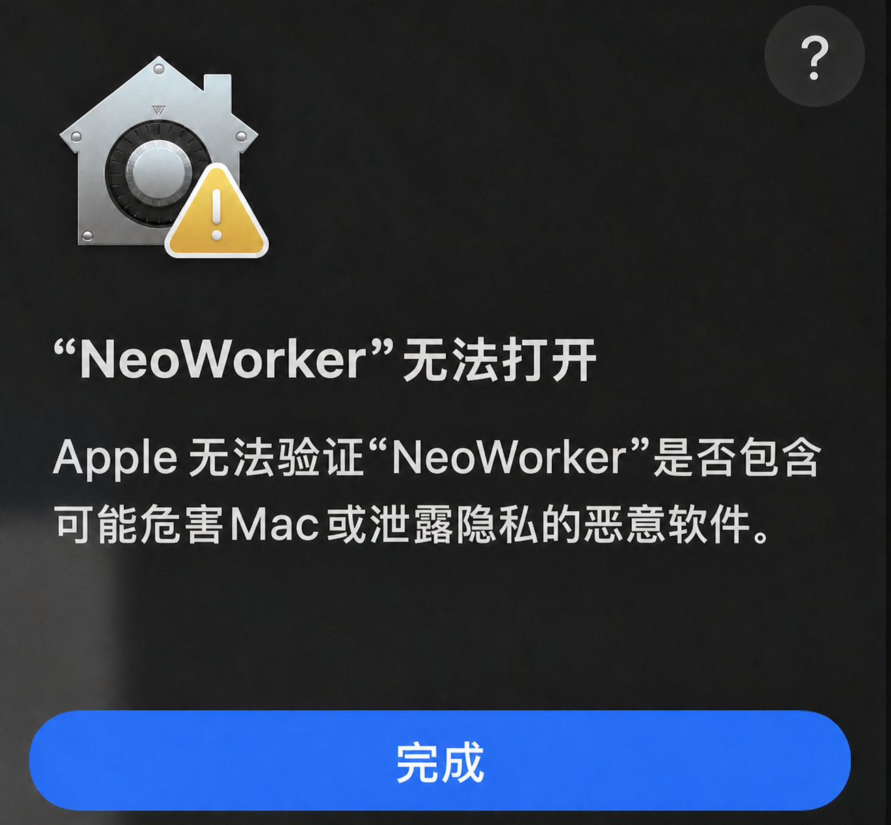
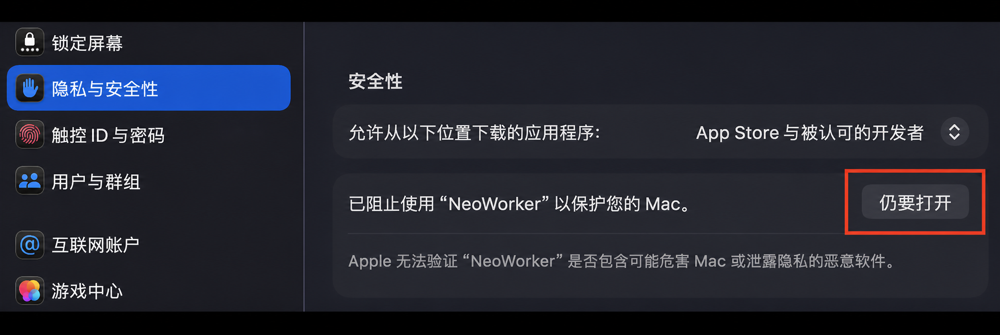
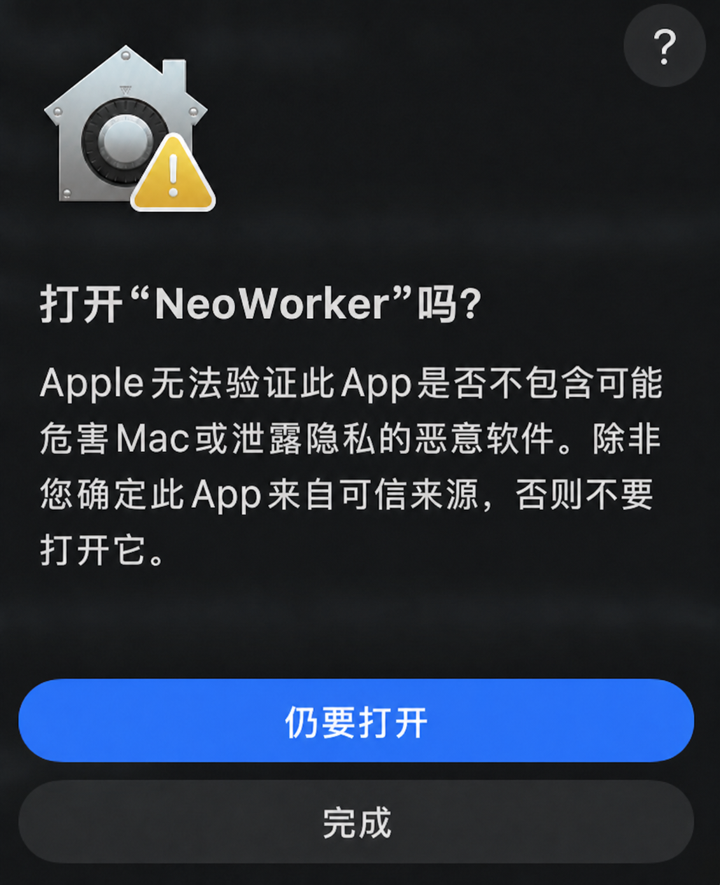

<p align="right">
  <a href="../README.md">English</a> | <strong>简体中文</strong>
</p>

<p align="center">
  
</p>

<h1 align="center">NeoWorker</h1>

<p align="center">
  <strong>GUI 优先、CLI 可用、本地优先的个人智能工作系统。</strong><br>
  让 AI 不只回答问题，而是读取上下文、调用工具、推进任务，并交付真正可打开、可修改、可追溯的工作成果。
</p>

<p align="center">
  <a href="https://github.com/Yuan-lab-LLM/NeoWorker/releases/latest"></a>
  <a href="https://github.com/Yuan-lab-LLM/NeoWorker/actions/workflows/ci.yml"></a>
  <a href="../LICENSE"></a>
  = 24">
  
</p>

<p align="center">
  <a href="#neoworker-是什么">简介</a>
  &nbsp;·&nbsp;
  <a href="#neoworker-如何工作">工作方式</a>
  &nbsp;·&nbsp;
  <a href="#快速开始">快速开始</a>
  &nbsp;·&nbsp;
  <a href="#neoworker-能做什么">功能</a>
  &nbsp;·&nbsp;
  <a href="./features.md">完整能力</a>
  &nbsp;·&nbsp;
  <a href="./architecture.md">架构</a>
  &nbsp;·&nbsp;
  <a href="./SECURITY.md">安全</a>
  &nbsp;·&nbsp;
  <a href="./CONTRIBUTING.md">参与贡献</a>
</p>

## NeoWorker 是什么？

NeoWorker 是一个面向个人与小团队的**开源桌面 AI 工作系统**。它把对话、项目上下文、本地文件、模型、工具、Skills、自动化与多 Agent 协作集中在同一个工作台中，让用户可以从一句自然语言需求出发，完成从理解目标、规划步骤、调用工具到交付成果的完整过程。

它不是只生成文字回答的聊天机器人。NeoWorker 可以在权限可控的运行时中操作文件、终端、浏览器和 Office 文档，执行研究、写作、数据分析、代码修改与重复性流程，并将结果交付为真正可打开、可编辑、可继续迭代的 DOCX、XLSX、PPTX、PDF、HTML、图片或代码文件。

NeoWorker 采用本地优先、模型可替换、能力可扩展的设计：工作区、任务记录和产物保存在本机；用户可以接入不同模型服务，通过 Skills 与 MCP Connectors 扩展专业能力；执行步骤、权限审批、失败重试和最终交付均保留记录，便于检查、恢复与长期推进。

## NeoWorker 如何工作

<p align="center">
  
  <br><em>描述目标，NeoWorker 负责规划、执行并交付可以继续使用的成果。</em>
</p>

用户只需说明目标、已有资料和期望交付物。NeoWorker 会结合当前工作区理解上下文，制定执行步骤，调用合适的模型、工具与 Skills，在必要时请求权限确认，最后检查并交付结果。

## 为什么是 NeoWorker？

- **一个应用承接完整工作**：研究、写作、数据分析、代码修改、网页操作、Office 文件、自动化和消息渠道都在同一个任务工作区中完成。
- **GUI 优先，CLI 可用**：桌面端负责会话、文件、审批和可视化执行；`neoworker` CLI 使用同一套本地运行时、模型设置、技能和工作区。
- **任务，而不只是聊天**：Agent 可以制定步骤、调用工具、处理失败、等待审批、继续执行，并把过程保留在任务时间线里。
- **成果优先**：DOCX、XLSX、PPTX、PDF、HTML、Markdown、图片和代码都可以成为正式产物，而不是只返回一句“已经生成”。
- **文件可以继续改**：产物与任务保持关联，可在工作台中预览、下载、打开，并继续要求 Agent 修改。
- **模型与工具可扩展**：支持多种模型服务、OpenAI 兼容接口、Skills、MCP Connectors 和本地工具组合。
- **长期工作可持续**：项目、工作区、记忆、Agent 团队与自动化让一次对话可以演变为持续推进的工作流。
- **高权限操作可治理**：文件写入、Shell、浏览器和外部应用操作受工作区边界、权限模式和审批策略控制。

<p align="center">
  
  <br><em>连接工具、构建知识、自动化任务，让同一个工作台承接完整过程。</em>
</p>

## NeoWorker 的方向

NeoWorker 聚焦把 AI 从对话助手升级为能够持续理解上下文、执行任务并交付成果的个人智能工作系统。项目重点放在以下方向：

| 方向 | NeoWorker 的重点 |
| --- | --- |
| **中文优先体验** | 优化中文界面、术语、引导、模型接入和国内常用消息渠道。 |
| **更低的使用门槛** | 默认自动判断任务需要执行、研究还是调用技能，减少用户先理解模式再工作的负担。 |
| **可靠的文件交付** | 强化 Office、PDF 和 HTML 的生成、发现、预览、下载、打开与完整性校验。 |
| **透明的执行过程** | 让步骤、工具调用、失败、重试、审批和最终产物都可以被用户检查。 |
| **独立的扩展生态** | Skills 与工具尽量保持可移植，可在 NeoWorker 之外的兼容 Agent 环境中复用。 |
| **本地工作中心** | 以本机工作区和本地运行记录为核心，同时允许按需连接云模型和外部服务。 |

## 当前版本

当前公开版本为 **`v0.1.8`**（安装包语义版本为 `0.1.8`），与 NeoWorker 应用内显示一致。GitHub Release 提供：

- macOS Apple Silicon `.dmg`
- Windows `.exe` 安装程序
- Linux Server x64 `.tar.gz` 服务端包
- 对应版本的更新说明和校验信息

版本变更请查看[版本记录](./CHANGELOG.md)。

## 快速开始

### 下载桌面应用

请仅从官方 [GitHub Releases](https://github.com/Yuan-lab-LLM/NeoWorker/releases/latest) 页面下载 NeoWorker。

| 平台 | 安装包 | 安装方式 |
| --- | --- | --- |
| **macOS（Apple Silicon）** | `NeoWorker-0.1.8-arm64.dmg` | 打开磁盘映像，将 NeoWorker 拖入“应用程序”。 |
| **Windows（x64）** | `NeoWorker-0.1.8-windows-x64-setup.exe` | 运行安装程序并按提示完成安装。 |
| **Linux Server（x64）** | `neoworker-server-linux-x64-v0.1.8.tar.gz` | 解压后按服务端说明启动。 |
| **校验文件** | `neoworker-server-linux-x64-v0.1.8.tar.gz.sha256` | 打开或解压安装包前核对下载文件。 |

#### 校验下载文件

对于 Linux Server 压缩包，请从同一个 Release 下载配套的 `.sha256` 文件，在解压前执行：

```bash
sha256sum --check neoworker-server-linux-x64-v0.1.8.tar.gz.sha256
```

桌面安装包使用 Electron 更新清单 `latest-mac.yml` 和 `latest.yml`。打开安装包前，请确认清单中的版本和文件名均为 `0.1.8`。

#### macOS 安装须知

NeoWorker v0.1.8 的 macOS 安装包适用于 Apple Silicon，当前为未签名构建，因此首次启动时可能需要针对 NeoWorker 完成一次 Gatekeeper 放行。

1. 从官方 [NeoWorker v0.1.8 Release](https://github.com/Yuan-lab-LLM/NeoWorker/releases/tag/v0.1.8) 页面下载 `NeoWorker-0.1.8-arm64.dmg`。
2. 双击打开下载的磁盘映像，将 **NeoWorker** 拖到 **应用程序（Applications）** 文件夹。

   <p align="left">
     
     <br>
     <sub>NeoWorker 真实磁盘映像窗口：将 NeoWorker 拖入 Applications。</sub>
   </p>

3. 打开 Finder 的 **应用程序** 文件夹，双击 **NeoWorker**。如果能够直接启动，安装已经完成。
4. 如果 macOS 显示 **“NeoWorker” 无法打开**，点击 **完成**，暂时不要删除应用。

   <p align="left">
     
     <br>
     <sub>macOS 界面示意；不同系统版本的文案可能略有差异。</sub>
   </p>

5. 打开 **Apple 菜单 → 系统设置 → 隐私与安全性**，下滑到 **安全性** 区域，确认被阻止的应用是 **NeoWorker**，点击 **仍要打开**。

   <p align="left">
     
     <br>
     <sub>“仍要打开”只会为 NeoWorker 创建单应用例外。</sub>
   </p>

6. 在二次确认窗口中再次点击 **仍要打开**；如系统要求，请输入 Mac 登录密码或使用 Touch ID。

   <p align="left">
     
     <br>
     <sub>仅在安装包来自 NeoWorker 官方 Release 时确认打开。</sub>
   </p>

完成这次确认后，macOS 会将 NeoWorker 保存为单应用例外，以后可以正常双击启动。Apple 说明“仍要打开”按钮通常会在尝试启动被拦截应用后的约一小时内显示。

如果没有看到 **仍要打开**，并且你确认安装包来自官方 Releases 页面且校验值正确，可在“终端”中执行下面的单应用兜底命令：

```bash
sudo xattr -rd com.apple.quarantine "/Applications/NeoWorker.app"
open "/Applications/NeoWorker.app"
```

该命令只会移除已安装 NeoWorker 的下载隔离属性，不会在整个系统范围内关闭 Gatekeeper。Apple 官方的 **仍要打开** 操作说明请参阅：[安全地打开 Mac 上的 App](https://support.apple.com/zh-cn/102445)。

如果 macOS 明确提示 NeoWorker **“将对电脑造成伤害”**，请不要绕过该警告。删除当前安装包，从官方 Releases 页面重新下载并核对发布页提供的校验值；如果仍然出现，请提交 Issue，并附上 NeoWorker 版本、macOS 版本和完整提示内容。

#### Windows 安装须知

1. 从官方 [NeoWorker v0.1.8 Release](https://github.com/Yuan-lab-LLM/NeoWorker/releases/tag/v0.1.8) 页面下载 `NeoWorker-0.1.8-windows-x64-setup.exe`。
2. 双击安装程序，按界面提示完成安装。
3. 如果 Windows SmartScreen 显示**“Windows 已保护你的电脑”**，先确认文件名是本 Release 提供的 NeoWorker 安装程序，再点击**“更多信息” → “仍要运行”**。
4. 安装完成后，从开始菜单或桌面快捷方式启动 **NeoWorker**。

首次启动后，进入 **设置 → AI 与模型**，连接模型服务、测试连接并选择默认模型。macOS 与 Windows 安装包均不包含任何 API Key。

### 从源码运行

环境要求：Node.js 24+、npm 与 Git。

```bash
git clone https://github.com/Yuan-lab-LLM/NeoWorker.git
cd NeoWorker
npm install
npm run dev
```

`npm run dev` 会启动 Vite 开发服务器和 Electron 桌面应用。

### 使用 CLI

```bash
npm run build:cli
node bin/neoworker-cli.js --help
node bin/neoworker-cli.js run "总结当前工作区，并列出最需要处理的三个问题"
```

CLI 与桌面端共享本地配置、模型路由、工作区、Skills 和 MCP 设置。远程 Control Plane 仅在显式使用远程模式时需要单独配置。

### 第一次启动

1. 在 **设置 → AI 与模型** 中连接一个模型服务或 OpenAI 兼容接口。
2. 测试连接，并选择默认模型。
3. 选择工作区文件夹；只想体验时可以先使用临时工作区。
4. 新建任务，描述目标、已有资料和希望得到的交付物。
5. 当任务需要敏感写入、Shell 或外部应用操作时，检查权限申请后再决定是否允许。

> [!IMPORTANT]
> 不要把 API Key、访问令牌或私密配置提交到 Git。分享截图、日志和任务记录前，请先移除个人信息与凭据。

## NeoWorker 能做什么

### Agent Runtime

- 面向任务的长时间执行、动态规划和失败恢复
- 会话级状态、检查清单、权限和恢复快照
- 读取并行、冲突写入串行的工具调度
- Agent 团队、角色分工与项目上下文
- 模型路由、备用模型和多模型协作
- 执行步骤、工具调用、重试和完成状态可视化

### Everything Workbench

NeoWorker 把“生成文件”作为任务的正式结果。文件创建后会进入统一的产物工作台，而不是只在回复中显示一个文件名。

| 产物 | 支持的工作方式 |
| --- | --- |
| **Word / DOCX** | 生成、预览、编辑、保存、下载、外部打开和继续修改。 |
| **Excel / XLSX / CSV** | 表格预览与编辑、复制、保存、继续分析和生成新版本。 |
| **PowerPoint / PPTX** | 缩略图、翻页、缩放、演讲者备注、缓存渲染和继续修改。 |
| **PDF** | 页面预览、文本提取、OCR 状态、内容问答与视觉检查。 |
| **HTML / Web** | 沙箱预览、刷新、外部浏览器打开和构建结果识别。 |
| **Markdown / Code / JSON** | 语法展示、复制、外部打开、目录定位和后续编辑。 |

### 研究、网页与知识工作

- 搜索、打开并交叉核验网页信息
- 读取 PDF、文档、表格、图片和工作区资料
- 使用应用内 Browser Workbench 进行真实页面操作与验证
- 把研究过程整理为带来源的报告、表格、PPT 或网页
- 建立项目知识库和可持续维护的研究资料库

### 开发者工作台

- 阅读和修改代码库
- 运行 Shell 命令、测试、构建和诊断
- 使用 PTY 终端标签处理交互式 CLI
- 在应用内浏览器验证前端页面和响应式布局
- 将代码、终端、浏览器、任务记录和审批保留在同一工作区

### 模型、Skills 与 Connectors

- 多模型服务商与 OpenAI 兼容接口
- 模型列表、默认模型、备用路由和连接测试
- 内置 Skills、外部 Skill 目录和技能路由
- MCP Connectors 与本地工具扩展
- Skills 作为增量工作流加入任务，而不是替换用户原始目标

### 自动化与消息渠道

- 定时任务、Webhook、事件触发和持续工作流
- 每次运行保留状态、结果和失败原因
- 需要时进入人工审批，而不是在后台无限等待
- 支持微信、企业微信、钉钉、飞书/Lark 及其他消息渠道
- 渠道任务仍受工作区、Agent 角色和工具权限限制

### 项目、记忆与 Agent 团队

- 工作区级长期上下文和 `.neoworker/` Workspace Kit
- 项目目标、项目文件、最近工作和任务关系
- 本地记忆、可审查的记忆写入和隐私控制
- 可复用的 Managed Agents、角色配置和团队协作
- 自动化、项目和会话之间保持可追溯关系

## 可以直接尝试的任务

```text
分析这个代码库为什么启动失败，修复后运行测试，并说明改动范围。

读取当前文件夹里的调研资料，生成一份带来源和数据表格的 Word 报告。

比较三家供应商，生成 Excel 对比表和一份管理层汇报 PPT。

打开本地网页，分别检查桌面、平板和手机尺寸下的主要流程。

每个工作日上午检查项目进度，只有发现阻塞或风险时再提醒我。
```

## 运行机制

NeoWorker 的 Electron 桌面端与 CLI 共享同一套本地 Agent Runtime。模型负责理解和决策，运行时负责会话状态、工具调度、权限控制、失败恢复与结果归档。

- **模型不会直接获得无限权限**：可用工具先经过模式、工作区和权限规则过滤。
- **读取与写入分开调度**：安全读取可以并行，冲突写入会串行执行并保持结果顺序。
- **产物属于任务**：文件会关联到生成它们的会话，便于预览、修改和追溯。
- **本地优先不等于完全离线**：云模型、联网搜索和外部连接器仍受对应服务商的数据政策约束。

## 项目结构

```text
NeoWorker/
├── src/electron/      # Electron 主进程、Agent Runtime、工具与本地服务
├── src/renderer/      # React 桌面界面
├── src/shared/        # 主进程与渲染进程共享的类型和协议
├── src/cli/           # NeoWorker CLI
├── resources/skills/  # 内置 Skills
├── connectors/        # MCP Connectors
├── scripts/           # 构建、打包和质量检查脚本
├── docs/              # 产品与技术文档
└── build/              # 应用图标和打包资源
```

## 开发与构建

| 命令 | 用途 |
| --- | --- |
| `npm run dev` | 启动 Electron + Vite 开发环境。 |
| `npm run type-check` | 执行 TypeScript 类型检查。 |
| `npm test` | 运行 Vitest 测试。 |
| `npm run build` | 构建渲染端、Electron、Daemon 和 CLI。 |
| `npm run build:cli` | 单独构建 CLI。 |
| `npm run office:release-gate` | 运行 Office 产物发布门禁。 |
| `npm run skills:validate-routing` | 校验 Skills 路由。 |
| `npm run skills:validate-content` | 校验 Skills 内容。 |
| `npm run package:mac:unsigned` | 生成本地测试用的未签名 macOS 包。 |
| `npm run package:mac` | 使用已配置的签名环境生成 macOS 发布包。 |

提交代码前至少运行：

```bash
npm run type-check
npm test
```

## 安全与隐私

- 任务记录、工作区索引和本地记忆优先保存在本机。
- API Key 与敏感设置使用系统安全存储和加密配置管理。
- 文件、Shell、浏览器和外部应用操作受工作区边界、权限模式与审批策略限制。
- 不可信网页和文档被视为数据来源，而不是可以覆盖用户目标的指令。
- 开启“完全访问”前，应确认任务来源、执行范围和预期写入位置。
- 调用第三方模型、搜索或连接器时，请同时遵守对应服务商的隐私与数据保留政策。

发现安全问题时，请不要提交公开 Issue。请通过仓库的 **Security Advisory** 私下报告，详情见[安全政策](./SECURITY.md)。

## 文档

| 使用 NeoWorker | 开发与扩展 |
| --- | --- |
| [Getting Started](./getting-started.md) | [系统架构](./architecture.md) |
| [功能总览](./features.md) | [开发指南](./development.md) |
| [Everything Workbench](./everything-workbench.md) | [模型服务商](./providers.md) |
| [自动化任务](./task-automations.md) | [权限系统](./permission-system.md) |
| [消息渠道](./channels.md) | [NeoWorker CLI](./cli.md) |

另请参阅[版本记录](./CHANGELOG.md)。

## 参与贡献

欢迎提交 Bug、文档改进和功能实现。开始前请阅读：

- [贡献指南](./CONTRIBUTING.md)
- [行为准则](./CODE_OF_CONDUCT.md)
- [安全政策](./SECURITY.md)

较大的功能改动建议先在 Issue 中说明问题、使用场景、预期行为和验证方式，再提交 Pull Request。

## 许可证

NeoWorker 基于 [MIT License](../LICENSE) 发布。完整版权与许可信息请查看 [LICENSE](../LICENSE)。

---

<p align="center">
  <strong>NeoWorker</strong><br>
  AI · Work · Ready
</p>
