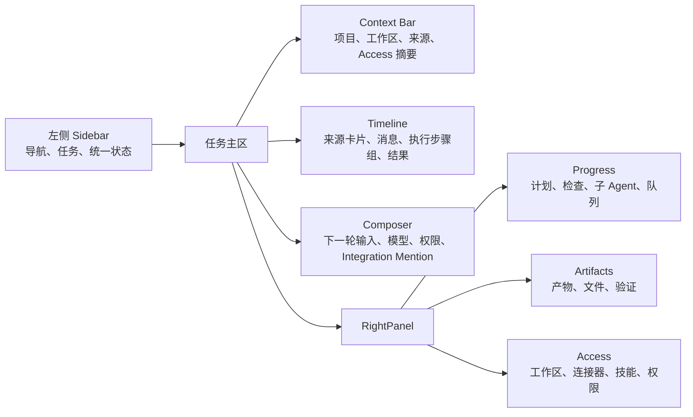
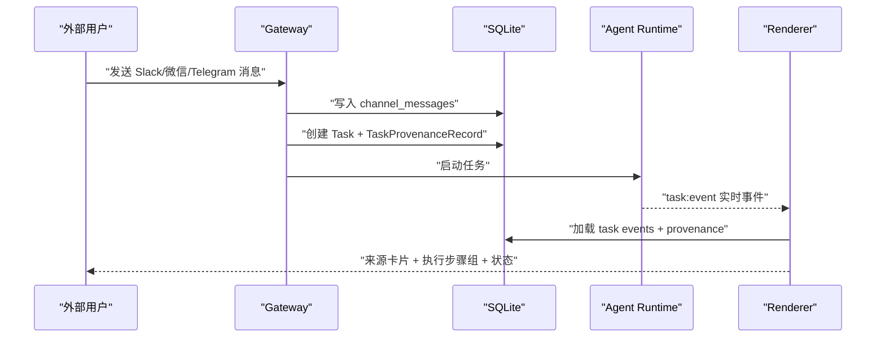
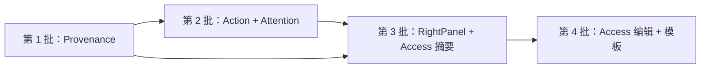
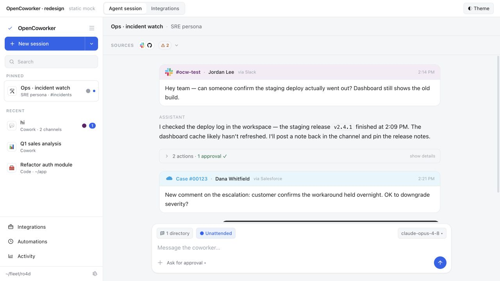
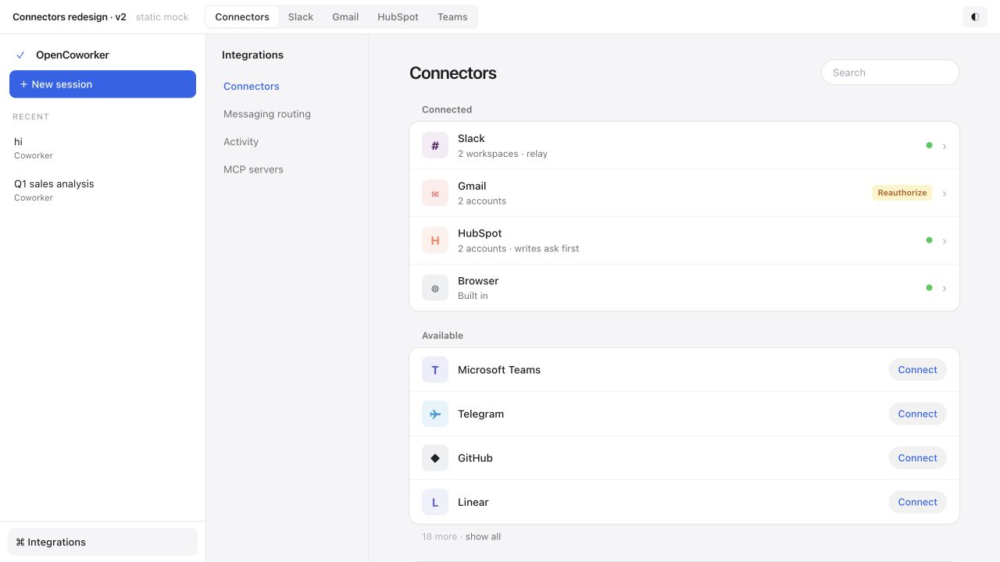
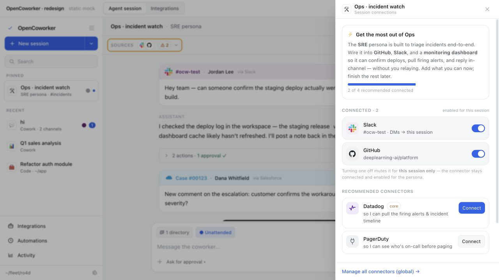
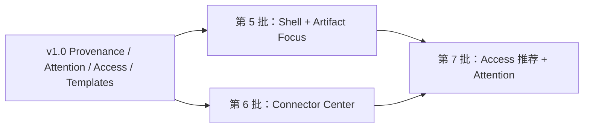

# NeoWorker 可执行工作透明度 UI — 产品需求与开发规格

| 字段 | 内容 |
| --- | --- |
| 文档状态 | Ready for product/engineering review |
| 版本 | v1.1 |
| 日期 | 2026-08-03 |
| 适用版本 | NeoWorker / NeoWorker 0.5.x+ |
| 目标读者 | 产品、设计、Renderer、Electron/IPC、Agent Runtime、QA |
| 参考项目 | [andrewyng/openworker](https://github.com/andrewyng/openworker) |
| 参考界面 | [OpenWorker redesign mock](https://github.com/andrewyng/openworker/blob/main/ui-mocks/redesign.html) |
| 参考快照 | OpenWorker `01b6f83b3927e02912dda84bb392942c13ca70d1`（2026-08-01） |

## 0. 执行摘要

本需求旨在提升 NeoWorker 作为“可执行 AI 工作平台”的可理解性与可信度。用户在一个任务中应始终能够回答：

1. 这项工作从哪里发起、依赖了哪些外部信息？
2. Agent 做过哪些动作，哪些动作需要或已经获得批准？
3. 当前任务能访问哪些工作区、连接器、技能和权限？
4. 任务现在是在运行、等待、需要批准、需要处理，还是已经完成？
5. 最终产物在哪里，如何回到产生它的任务和来源？

本方案不复制 OpenWorker 的视觉布局，而是借鉴其来源卡片、步骤折叠、会话级 Access 和结果闭环。实现上优先复用 NeoWorker 已存在的：

- Timeline V2 与 `TaskEvent.groupId` / `stepId`
- `ActionBlock`
- `RightPanel`
- Integration Mention
- Gateway `channel_messages` / `channel_sessions`
- 审批与 Permission Engine
- 项目、工作区和多任务会话模型

新增的核心基础设施只有两类：

- 可持久化、可追溯的任务输入来源 `TaskProvenanceRecord`
- 明确区分全局可用能力和任务实际授权范围的 `TaskAccessPolicy`

## 1. 背景与问题

### 1.1 当前产品基础

NeoWorker 已具备较完整的执行型 Agent UI：

- `MainContent` 展示用户消息、Agent 消息、工具事件、审批、产物卡片和子任务
- `ActionBlock` 能对工具调用与步骤做摘要折叠
- `RightPanel` 已包含进度、检查清单、子 Agent、队列、文件、Active Context 和使用上下文
- `Sidebar` 已有任务状态、子任务树、等待处理等信息
- Gateway 已能从 Slack、Telegram、Discord、微信、钉钉等渠道创建任务
- `channel_messages` 已持久化外部消息，但任务时间线没有统一、稳定的来源展示模型
- Integration Mention 能影响工具路由，但“已连接”和“本任务可使用”在 UI 上仍容易混淆

### 1.2 核心问题

#### P-01 来源丢失

来自外部渠道的消息创建任务后，桌面端主要显示任务 prompt。平台、频道、发送者、原始消息 ID 和时间等信息没有形成稳定的任务来源卡片。

#### P-02 执行步骤仍可能过于技术化

现有 ActionBlock 已有良好基础，但工具调用、审批、错误和结果之间的关联不够稳定。用户可能看到“做了很多事”，却不能快速判断：

- 一共完成几步
- 是否有动作等待批准
- 哪一步失败
- 哪些步骤产生了文件或外部副作用

#### P-03 权限作用域不清晰

全局连接器状态、用户在 composer 中的 Integration Mention、工作区权限、shell 权限和任务 Permission Mode 分散在不同位置。用户不容易区分：

- 系统已连接什么
- 当前任务实际允许使用什么
- 当前轮次临时增加了什么
- 修改权限何时生效

#### P-04 状态语法不统一

Sidebar、任务正文、RightPanel、项目页和审批弹窗使用不同状态词、颜色和图形，同一个任务可能同时显示 `executing`、`Working`、`Waiting`、`Needs approval` 等不同概念。

#### P-05 右栏信息重复和层级偏多

RightPanel 已有丰富信息，但栏目数量较多。Progress、Checklist、Queue、Files、Active Context、Context 之间存在理解成本，完成态与执行态的默认展开策略也不够结果导向。

## 2. 产品目标

### 2.1 目标

- G-01：外部来源创建或推进的任务，100% 能在任务时间线中展示可识别来源。
- G-02：用户在折叠态即可识别一个执行组的步骤数、工具动作数、批准数、错误数和产物数。
- G-03：用户最多一次点击即可看到当前任务的工作区、连接器、技能和权限范围。
- G-04：Sidebar、项目页、任务正文和 RightPanel 使用同一套任务注意力状态。
- G-05：任务完成后，RightPanel 优先展示产物和验证结果，而不是运行时噪声。
- G-06：所有新增信息在应用重启、任务续写、分叉和项目切换后保持正确。
- G-07：不显著增加任务首屏渲染时间，不引入 Sidebar N+1 查询。

### 2.2 非目标

- NG-01：不复制 OpenWorker 的双侧栏、配色、emoji 图标或品牌表达。
- NG-02：不重写 Timeline V2，不创建第二套任务事件系统。
- NG-03：v1 不重做 Connector OAuth、MCP 管理或全局设置页面。
- NG-04：v1 不改变 Permission Engine 的安全决策；先提升透明度，再分阶段开放任务级编辑。
- NG-05：不把 RightPanel 之外再增加第四个常驻面板。
- NG-06：不把第三方消息全文复制到新的分析或云端服务。
- NG-07：不以视觉状态代替真实运行状态，所有 UI 必须由持久化数据或 Agent Runtime 状态推导。

## 3. 用户与用户故事

### 3.1 目标用户

- 通过桌面端直接创建任务的个人用户
- 从 Slack、Telegram、微信等外部渠道发起任务的用户
- 同时管理多个项目、工作区和 Agent 的重度用户
- 需要审核高风险动作的管理员或任务负责人
- 查看自动化、后台任务和远程设备任务的操作者

### 3.2 核心用户故事

| ID | 用户故事 |
| --- | --- |
| US-01 | 作为用户，我希望知道这项任务来自哪个平台、频道和发送者，避免误把外部指令当成本地输入。 |
| US-02 | 作为用户，我希望在不展开全部技术日志时知道 Agent 做了几步、是否成功、是否等待批准。 |
| US-03 | 作为用户，我希望知道当前任务可以访问哪些连接器和文件夹，以及权限修改何时生效。 |
| US-04 | 作为审批人，我希望看到被批准动作的范围、来源和后果，而不是原始参数 JSON。 |
| US-05 | 作为项目负责人，我希望项目、侧栏和任务详情对“需要处理”有一致判断。 |
| US-06 | 作为产物消费者，我希望完成后直接看到文档、表格、演示文稿和相关验证结果。 |
| US-07 | 作为自动化用户，我希望无人值守任务在需要人工处理时进入统一注意力状态。 |

## 4. 产品原则

1. **来源先于内容**：外部输入必须说明来自哪里，再展示内容。
2. **结果先于过程**：默认展示可理解摘要，技术细节按需展开。
3. **全局连接不等于任务授权**：系统可用能力和当前任务访问范围必须分层。
4. **状态只有一套真相**：所有表面从同一个状态推导函数获得注意力状态。
5. **进行中的权限被冻结到轮次**：权限变更只影响下一轮或下一个安全检查点。
6. **失败必须可恢复**：来源不可打开、连接器离线、权限加载失败都必须给出明确状态与重试入口。
7. **不泄露敏感标识**：外部 ID 默认隐藏，用户主动查看时才展示。

## 5. 范围与优先级

### 5.1 P0 — 第一发布范围

- 任务来源持久化和来源卡片
- ActionBlock 扩展为完整执行步骤组
- 统一任务注意力状态
- RightPanel 信息架构收敛
- 只读任务 Access 摘要
- Gateway、手工任务、cron/hook/API 的来源兼容
- Electron E2E、迁移、性能和可访问性基础测试

### 5.2 P1 — 第二发布范围

- 可编辑任务 Access 策略
- 权限变更下一轮生效提示
- 扩展来源深链覆盖：邮件、外部记录、本地事件详情及更多 provider-specific 定位
- 结果导向的新任务模板和连接准备状态
- 项目页中展示任务来源与注意力统计

### 5.3 P2 — 后续增强

- 来源链与多来源证据图
- 管理员级 Access 策略模板
- 自动化来源与授权差异对比
- 跨任务来源聚合与风险审计
- 来源完整性/可信度与 Agent Integrity 系统联动

## 6. 目标信息架构



### 6.1 信息归属规则

| 信息 | 唯一主展示位置 | 其他位置的表达 |
| --- | --- | --- |
| 任务来源 | Timeline 来源卡片 | Context Bar 只显示图标和短标签 |
| 项目与工作区 | Context Bar | RightPanel Access 展示完整范围 |
| 执行步骤 | Timeline ActionBlock | RightPanel Progress 展示总体进度 |
| 产物 | RightPanel Artifacts | Timeline 只显示生成时的产物卡片 |
| 连接器与权限 | RightPanel Access | Composer/Context Bar 只显示摘要和入口 |
| 任务状态 | 统一 `TaskAttentionState` | 各表面使用同一状态文案和图形 |

## 7. 功能需求

### 7.1 FR-01 任务来源与来源卡片

#### 7.1.1 来源类型

系统必须支持以下来源：

```ts
type TaskProvenanceSourceKind =
  | "manual"
  | "gateway_message"
  | "mail_thread"
  | "connector_record"
  | "automation_run"
  | "api_request"
  | "hook_event"
  | "system_generated";
```

说明：

- `Task.source` 继续表示任务创建方式，不承载发送人、频道或外部对象详情。
- `AgentConfig.originChannel` 继续用于运行时渠道限制。
- `TaskProvenanceRecord` 表示真正的输入来源。
- Integration Mention 表示本任务允许/希望使用的能力，不属于来源。

#### 7.1.2 卡片展示

当 `sourceKind !== manual` 时，用户消息上方必须展示来源卡片。

卡片头部必须包含：

- 连接器/渠道品牌图标
- 渠道或来源名称
- 发送者或触发器名称
- 相对时间
- `来自 Slack`、`来自 Gmail`、`由自动化触发` 等来源文案

卡片正文必须包含：

- 触发任务的原始文本或安全摘要
- 附件名称、类型与数量
- 原始文本被截断时的明确提示

可选动作：

- `打开来源`：存在受支持深链时显示
- `查看原始标识`：展示 channel ID、sender ID、message ID 等技术信息
- `复制来源链接`：仅在来源提供可安全复制的定位符时显示
- `查看附件`：复用现有附件/文件预览

#### 7.1.3 默认行为

- 手工桌面任务不显示额外来源卡片。
- 同一外部消息重复投递不得生成重复来源记录。
- 外部后续消息推进同一会话时，每条消息拥有独立 provenance 记录。
- 任务分叉时复制可读 provenance 引用，不复制外部消息全文。
- 子任务默认继承父任务的“触发来源摘要”，并标记为 `inherited`，不得伪装成直接外部输入。
- 来源不可打开时，卡片仍保留历史信息，并显示“原来源当前不可访问”。
- 未知连接器使用通用 Plug 图标，不使用 emoji。

#### 7.1.4 隐私与安全

- 默认不显示原始 sender/channel/message ID。
- 来源摘要最长 4,096 字符；完整正文继续由原数据域持有。
- provenance metadata 禁止存储 access token、cookie、API key、OAuth code。
- Analytics 不上报消息正文、发送人姓名或外部 ID。
- 外部链接打开前继续走现有安全 URL 与权限策略。

#### 7.1.5 空态与错误态

| 状态 | UI |
| --- | --- |
| 来源正在加载 | 单行 skeleton，不阻塞消息正文 |
| provenance 不存在 | 按现有普通用户消息渲染 |
| provider 未识别 | 通用图标 + `外部来源` |
| 原消息已删除 | 显示历史摘要 + `原消息已不可用` |
| 无权打开 | 显示来源信息 + `当前账号无权打开` |
| IPC 失败 | 卡片内错误提示和 `重试`，不得让整条时间线失败 |

### 7.2 FR-02 执行步骤组

#### 7.2.1 复用基础

本需求扩展现有 `ActionBlock`，不得创建第二套步骤组件。分组必须基于：

1. Timeline V2 `groupId`
2. Timeline V2 `stepId`
3. 用户消息与最终 Agent 消息边界
4. 工具调用与工具结果配对
5. 审批请求与批准/拒绝事件配对

#### 7.2.2 折叠态

折叠态必须展示：

- 语义摘要，例如 `读取 8 个文件并完成 3 次搜索`
- 状态：运行中、等待批准、完成、部分完成、失败、取消
- 步骤数
- 工具动作数
- 批准数与待批准数
- 错误数
- 产物数
- 执行时长；不足 1 秒时显示 `<1 秒`

示例：

```text
✓ 分析代码并生成报告 · 6 步 · 9 个动作 · 1 次批准 · 2 个产物 · 18 秒
```

等待批准时：

```text
! 正在修改发布配置 · 4 步 · 1 项等待批准
```

#### 7.2.3 展开态

展开后按真实事件顺序显示：

- Agent 对步骤的可见说明
- 人类可读工具动作名称
- 关键参数摘要
- 作用范围，例如文件路径、域名、连接器、目标频道
- 批准状态与批准范围
- 工具结果摘要
- 失败原因与恢复动作
- 关联产物

不得默认展示：

- 原始大 JSON
- 完整命令输出
- 重复流式增量
- 内部 reasoning
- 被 `debug-only` 分类的事件

技术细节继续通过 `查看详情`、Task Trace 或 Debug 模式提供。

#### 7.2.4 分组规则

- 同一 `groupId` 的事件必须属于同一组。
- 缺少 `groupId` 时，以用户消息到最终 Agent 消息作为一个 Turn Group。
- `tool_call` 与最近的匹配 `tool_result/tool_error` 配对。
- `approval_requested` 按 `approvalId` 优先配对；缺少 ID 时按同工具、最近时间配对。
- 待批准事件必须留在组内，同时提升整个组的注意力状态。
- `artifact_created` / `timeline_artifact_emitted` 计入产物数，但产物卡片可在组外单独展示。
- 并行 Agent 继续使用现有 parallel group projection，不展开为重复的顶级组。
- 分组算法必须为 O(n)，不得对每个事件重新扫描完整列表。

#### 7.2.5 实时更新

- 新事件到达时只更新受影响 ActionBlock。
- 运行中的组自动保持折叠，除非用户主动展开或组进入待批准/失败状态。
- 用户手动展开/折叠状态在当前任务生命周期内保持。
- 任务切换后恢复该任务最近的折叠状态；最多缓存 100 个任务。
- 晚到的 tool result 不得生成第二个重复步骤。
- 事件回放与实时事件必须产生一致的分组结果。

### 7.3 FR-03 统一任务注意力状态

新增 renderer/shared 可复用的派生状态：

```ts
type TaskAttentionState =
  | "idle"
  | "working"
  | "waiting"
  | "needs_approval"
  | "needs_attention"
  | "done"
  | "failed";
```

#### 7.3.1 优先级

从高到低：

1. `needs_approval`
2. `needs_attention`
3. `failed`
4. `working`
5. `waiting`
6. `done`
7. `idle`

说明：失败任务如果存在尚未处理的用户动作，显示 `needs_attention`；纯失败且无可操作项显示 `failed`。

#### 7.3.2 推导表

| Attention state | 推导条件 | 中文文案 | 图形要求 |
| --- | --- | --- | --- |
| needs_approval | pending approval 或 terminalStatus=awaiting_approval | 待批准 | 实心状态图标 + 数量 |
| needs_attention | needs_user_action、blocked、待回答、恢复可用 | 需要处理 | 感叹号图标，不只依赖颜色 |
| failed | failed 且无可恢复动作 | 失败 | 错误图标 |
| working | planning/executing/queued 且有活动 | 进行中 | 可选低频 pulse，遵守 reduced-motion |
| waiting | paused、外部依赖等待、队列等待 | 等待中 | 静态时钟/暂停图标 |
| done | completed + terminal ok/partial_success | 已完成/部分完成 | 勾选图标 |
| idle | pending 且未开始 | 尚未开始 | 空心圆 |

#### 7.3.3 使用位置

- Sidebar 任务行
- 项目任务列表
- Task Context Bar
- RightPanel Progress 标题
- 执行步骤组
- 通知与任务详情

所有位置必须调用同一个 `deriveTaskAttentionState()`；禁止各组件自行写状态优先级。

### 7.4 FR-04 Task Context Bar

任务正文顶部新增/收敛一行 Context Bar。桌面宽度足够时展示：

- 项目名称（存在 `projectId` 时）
- 当前工作区
- 任务来源短标签
- 当前任务连接器图标，最多 4 个，更多显示 `+N`
- 权限模式短标签
- 注意力状态

交互：

- 点击项目：进入项目工作区
- 点击工作区：打开工作区选择/详情；项目任务只能选择已关联工作区
- 点击来源：滚动到最新来源卡片
- 点击连接器或权限：打开 RightPanel 的 Access 区
- Context Bar 只提供摘要，不在此处展开完整设置

响应式：

- 宽度 < 960px 时合并为 `上下文` 按钮 + 关键状态
- 宽度 < 760px 时隐藏非关键标签，只保留项目/工作区、状态和 Access 入口
- 不允许产生横向滚动

### 7.5 FR-05 RightPanel 信息架构收敛

#### 7.5.1 顶级栏目

RightPanel 顶级栏目收敛为：

1. `Progress`
2. `Artifacts`
3. `Access`

#### 7.5.2 现有栏目映射

| 现有栏目 | 新归属 |
| --- | --- |
| Progress | Progress |
| Checklist | Progress / Checklist 子区 |
| Collaborative Agents | Progress / Agents 子区 |
| Queue | Progress / Queue 子区 |
| Working Folder / Files | Artifacts / Files 子区 |
| Output summary | Artifacts 顶部 |
| Active Context | Access / Connected capabilities |
| Context / skills / tools / referenced files | Access / Used in this task |

#### 7.5.3 默认展开策略

| 任务状态 | Progress | Artifacts | Access |
| --- | --- | --- | --- |
| 新任务 | 展开 | 收起 | 展开 |
| 执行中 | 展开 | 有产物时展开 | 收起 |
| 待批准/需处理 | 展开并滚动到阻塞项 | 保持用户状态 | 展开相关权限 |
| 完成 | 收起 | 展开 | 收起 |
| 失败 | 展开 | 有保留产物时展开 | 收起 |

用户手动选择优先于自动策略；每个任务保存当前会话内的面板状态。

#### 7.5.4 Artifacts

Artifacts 顶部必须展示：

- 核心结果摘要
- 主产物
- 验证结果
- `部分完成但保留产物` 的明确提示

文件列表：

- 默认只展示产物与已修改文件
- 读取过但未修改的文件放在 Access / Used in this task
- 支持打开、在 Finder 中显示、复制完整路径
- 产物排序：主产物 > 最近修改 > 其他

### 7.6 FR-06 Task Access

#### 7.6.1 两层模型

| 层级 | 含义 | 示例 |
| --- | --- | --- |
| Global capability | 系统已配置或已连接 | Slack 已连接、GitHub MCP 可用 |
| Task access | 当前任务允许使用 | 本任务允许 Slack 和 GitHub，只读工作区 A |

UI 必须明确表达：`已连接 ≠ 本任务已授权`。

#### 7.6.2 P0 只读摘要

P0 Access 从现有数据推导：

- `workspaceId` 与 WorkspacePermissions
- 项目关联工作区
- `agentConfig.integrationMentions`
- `agentConfig.originChannel`
- `agentConfig.allowedTools` / `toolRestrictions`
- `shellAccess`
- 当前 Permission Mode
- 实际使用过的 connectors、skills、tools、referenced files

分类显示：

- `Available`：系统已连接但本任务未选择
- `Allowed`：本任务明确允许
- `Used`：本任务已经实际使用
- `Blocked`：策略或管理员规则禁止
- `Unavailable`：配置缺失或连接已断开

#### 7.6.3 P1 可编辑策略

- 用户可在下一轮开始前增删连接器范围。
- 用户可修改工作区读写范围、Permission Mode 与 shell access。
- 执行中的工具批次不热更新权限。
- 修改时显示：`将在下一轮生效`。
- 高风险权限提升继续经过现有批准/设置确认流程。
- 管理员 policy blocked 项不可编辑，并展示原因。
- 项目任务不得添加未关联工作区。
- Access 更新必须产生审计事件，不得静默修改。

#### 7.6.4 Access 状态失败

- 加载失败时保留最近一次成功快照，并标注 `状态可能已过期`。
- 连接器断开后不得从 UI 消失，显示 `连接已断开` 和重新连接入口。
- 策略更新失败必须回滚 UI，展示错误并允许重试。
- 并发更新使用 revision 乐观锁，冲突时重新加载。

### 7.7 FR-07 Sidebar 状态表达

任务行最多展示三种辅助信号：

1. `TaskAttentionState` 图标/计数
2. 来源品牌小图标
3. 子任务/并行任务状态

规则：

- 不同时展示两个含义相同的状态点。
- `needs_approval` 和 `needs_attention` 可显示数量。
- 来源图标只说明任务入口，不用品牌色充当状态色。
- Pinned 与 Recent 结构保持现状，不照搬 OpenWorker 的双模式侧栏。
- 侧栏列表数据不得逐任务查询 provenance 或 task_events。

### 7.8 FR-08 结果导向的新任务模板（P1）

首页/新任务空态展示 3–5 个具体产出模板，不使用泛化文案。

模板数据：

```ts
interface OutcomeTemplate {
  id: string;
  title: string;
  outcome: string;
  prompt: string;
  requiredConnectorIds?: string[];
  requiredWorkspace?: boolean;
  requestedSkillId?: string;
  category: "document" | "research" | "automation" | "operations" | "analysis";
}
```

卡片必须展示：

- 明确产出，例如 `生成一份可分享的客户简报`
- 简短结果说明
- 需要的连接器/工作区准备状态
- `开始` 或 `配置` 主动作

连接器未就绪时，点击进入现有连接流程；不得先创建一个必然失败的任务。

## 8. 核心交互流程

### 8.1 外部消息创建任务



验收重点：来源必须先于或与第一条用户消息一起出现，不得在任务执行后才补上。

### 8.2 手工任务使用 Integration Mention

1. 用户在 composer 选择 `@Slack`、`@GitHub`。
2. 创建任务时写入 Task Access，而不是 provenance。
3. Context Bar 显示两个已允许连接器。
4. Agent 实际使用连接器后，Access 中从 `Allowed` 进入 `Used`。
5. 工具调用在 ActionBlock 展示目标与结果。

### 8.3 等待批准

1. `approval_requested` 到达。
2. 当前 ActionBlock 状态提升为 `needs_approval`。
3. 任务整体状态提升为 `needs_approval`。
4. Sidebar、Context Bar、RightPanel 同步显示。
5. RightPanel Progress 展开并定位批准项。
6. 用户批准或拒绝后，原组内状态原位更新，不生成重复组。

### 8.4 完成并交付产物

1. Agent 生成文件并发出 artifact 事件。
2. ActionBlock 产物数增加。
3. Timeline 展示产物卡片。
4. 任务完成后 RightPanel 自动收起 Progress、展开 Artifacts。
5. 项目产物页仍可按 taskId 回到原任务和来源。

## 9. 数据与类型设计

### 9.1 设计边界

以下三个概念必须保持独立：

| 概念 | 现有/新增 | 用途 |
| --- | --- | --- |
| Task origin | 现有 `Task.source`、`AgentConfig.originChannel` | 谁/什么方式创建了任务以及运行时渠道限制 |
| Provenance | 新增 `TaskProvenanceRecord` | 哪条外部信息、哪个发送者或触发器形成了输入 |
| Access | 新增/归一化 `TaskAccessPolicy` | 当前任务被允许访问的工作区、连接器、工具和权限 |

禁止将连接器 mention 当作来源，也禁止将 `Task.source="api"` 当作完整来源记录。

### 9.2 共享类型

建议在 `src/shared/types.ts` 增加：

```ts
export type TaskProvenanceSourceKind =
  | "manual"
  | "gateway_message"
  | "mail_thread"
  | "connector_record"
  | "automation_run"
  | "api_request"
  | "hook_event"
  | "system_generated";

export type TaskProvenanceRelation = "direct" | "follow_up" | "inherited";

export interface TaskProvenanceActor {
  id?: string;
  displayName?: string;
  username?: string;
  kind: "user" | "bot" | "system" | "automation" | "unknown";
}

export interface TaskProvenanceConversation {
  id?: string;
  label?: string;
  threadId?: string;
  isGroup?: boolean;
}

export interface TaskProvenanceAttachment {
  name: string;
  mimeType?: string;
  size?: number;
  artifactId?: string;
}

export interface TaskProvenanceOpenTarget {
  kind: "external_url" | "gateway_message" | "mail_thread" | "connector_record" | "none";
  locator?: string;
}

export interface TaskProvenanceRecord {
  id: string;
  taskId: string;
  relation: TaskProvenanceRelation;
  sourceKind: TaskProvenanceSourceKind;
  providerKey?: string;
  providerLabel?: string;
  sourceRef?: string;
  externalId?: string;
  actor?: TaskProvenanceActor;
  conversation?: TaskProvenanceConversation;
  excerpt?: string;
  attachments: TaskProvenanceAttachment[];
  openTarget?: TaskProvenanceOpenTarget;
  occurredAt: number;
  createdAt: number;
  metadata?: Record<string, unknown>;
}

export type TaskAccessCapabilityState =
  | "available"
  | "allowed"
  | "used"
  | "blocked"
  | "unavailable";

export interface TaskAccessConnector {
  id: string;
  label: string;
  iconKey?: string;
  state: TaskAccessCapabilityState;
  toolNames?: string[];
  reason?: string;
}

export interface TaskAccessWorkspaceScope {
  workspaceId: string;
  rootPath?: string;
  access: "read" | "write";
  primary?: boolean;
}

export interface TaskAccessPolicy {
  taskId: string;
  revision: number;
  connectorIds: string[];
  workspaceScopes: TaskAccessWorkspaceScope[];
  allowedTools?: string[];
  blockedTools?: string[];
  permissionMode?: PermissionMode;
  shellAccess: boolean;
  effectiveFromTurn?: number;
  updatedAt: number;
}

export interface TaskAccessSummary {
  policy: TaskAccessPolicy;
  connectors: TaskAccessConnector[];
  usedSkillIds: string[];
  usedToolNames: string[];
  referencedFiles: string[];
  stale?: boolean;
}

export type TaskAttentionState =
  | "idle"
  | "working"
  | "waiting"
  | "needs_approval"
  | "needs_attention"
  | "done"
  | "failed";
```

### 9.3 数据库表

#### 9.3.1 `task_provenance`

```sql
CREATE TABLE IF NOT EXISTS task_provenance (
  id TEXT PRIMARY KEY,
  task_id TEXT NOT NULL REFERENCES tasks(id) ON DELETE CASCADE,
  relation TEXT NOT NULL,
  source_kind TEXT NOT NULL,
  provider_key TEXT,
  provider_label TEXT,
  source_ref TEXT,
  external_id TEXT,
  actor_json TEXT,
  conversation_json TEXT,
  excerpt TEXT,
  attachments_json TEXT NOT NULL DEFAULT '[]',
  open_target_json TEXT,
  occurred_at INTEGER NOT NULL,
  metadata_json TEXT,
  created_at INTEGER NOT NULL
);

CREATE INDEX IF NOT EXISTS idx_task_provenance_task_time
  ON task_provenance(task_id, occurred_at ASC);

CREATE UNIQUE INDEX IF NOT EXISTS idx_task_provenance_dedupe
  ON task_provenance(
    task_id,
    source_kind,
    COALESCE(provider_key, ''),
    external_id
  )
  WHERE external_id IS NOT NULL;
```

设计说明：

- `source_ref` 优先引用已有记录，例如 `channel_messages.id`、mail thread id、automation run id。
- `external_id` 用于跨进程/重复投递去重。
- `excerpt` 只保存安全显示摘要，最大 4,096 字符。
- `metadata_json` 必须经过 allowlist 清洗。
- 永久删除 task 时级联删除；归档/任务回收站期间保留。

#### 9.3.2 `task_access_policies`（P1）

```sql
CREATE TABLE IF NOT EXISTS task_access_policies (
  task_id TEXT PRIMARY KEY REFERENCES tasks(id) ON DELETE CASCADE,
  revision INTEGER NOT NULL DEFAULT 1,
  connector_ids_json TEXT NOT NULL DEFAULT '[]',
  workspace_scopes_json TEXT NOT NULL DEFAULT '[]',
  allowed_tools_json TEXT,
  blocked_tools_json TEXT,
  permission_mode TEXT,
  shell_access INTEGER NOT NULL DEFAULT 0,
  effective_from_turn INTEGER,
  updated_at INTEGER NOT NULL
);
```

P0 可先由现有 Task/AgentConfig/WorkspacePermissions 派生只读策略，但 P1 开始必须迁移到独立表，避免权限信息继续散落。

#### 9.3.3 迁移要求

- 使用下一可用 schema migration，不修改已有迁移。
- 旧任务不回填 `manual` provenance；没有 provenance 即按普通手工任务显示。
- Gateway 历史任务若能通过 `channel_sessions.task_id` 唯一关联，可做后台 best-effort 回填。
- 回填不得阻塞首次窗口加载。
- 所有 JSON 字段使用现有安全 parse helper。
- 新索引创建记录耗时日志，目标 < 500ms（常规本地库）。

### 9.4 Repository

新增：

```text
TaskProvenanceRepository
  create(input)
  createOrGetByExternalId(input)
  listByTaskId(taskId, limit, offset)
  listByTaskIds(taskIds)              # 批量/项目页使用
  cloneReferences(sourceTaskId, targetTaskId, relation="inherited")
  deleteByTaskId(taskId)

TaskAccessPolicyRepository
  get(taskId)
  createInitial(taskId, policy)
  update(taskId, expectedRevision, patch)
  delete(taskId)
```

要求：

- 去重必须由唯一索引兜底，不只依赖应用层查询。
- `update` 使用 `WHERE revision = ?` 乐观锁。
- Repository 不返回未清洗 metadata。
- `listByTaskIds` 设置任务数与总结果上限，避免项目页一次加载无限来源。

### 9.5 Task Event 扩展

新增 EventType：

```ts
| "task_provenance_attached"
| "task_access_updated"
```

Payload：

```ts
interface TaskProvenanceAttachedPayload {
  provenanceId: string;
  sourceKind: TaskProvenanceSourceKind;
  providerKey?: string;
  relation: TaskProvenanceRelation;
}

interface TaskAccessUpdatedPayload {
  revision: number;
  changed: Array<"connectors" | "workspaces" | "tools" | "permission_mode" | "shell_access">;
  effectiveFrom: "next_turn" | "immediate_safe_point";
}
```

Timeline V2 归一化：

- `task_provenance_attached` 映射为 `timeline_evidence_attached`，actor=`system`，但主 UI 使用专用 provenance 数据渲染。
- `task_access_updated` 映射为 `timeline_step_updated`，默认 `inspect-only`；权限提升需要在摘要时间线可见。
- 不把完整 provenance 或 Access policy 写入 event payload。

## 10. IPC 与 Preload 契约

### 10.1 新增 IPC

```ts
TASK_PROVENANCE_LIST = "task:provenance:list"
TASK_PROVENANCE_OPEN = "task:provenance:open"
TASK_ACCESS_GET = "task:access:get"
TASK_ACCESS_UPDATE = "task:access:update"
```

Preload：

```ts
listTaskProvenance(taskId: string): Promise<TaskProvenanceRecord[]>;

openTaskProvenance(input: {
  taskId: string;
  provenanceId: string;
}): Promise<{ opened: boolean; reason?: string }>;

getTaskAccess(taskId: string): Promise<TaskAccessSummary>;

updateTaskAccess(input: {
  taskId: string;
  expectedRevision: number;
  patch: Partial<Pick<
    TaskAccessPolicy,
    "connectorIds" | "workspaceScopes" | "allowedTools" |
    "blockedTools" | "permissionMode" | "shellAccess"
  >>;
}): Promise<TaskAccessSummary>;
```

### 10.2 校验

- 所有新 IPC 使用 zod schema。
- `taskId`、`provenanceId` 必须为非空 bounded string。
- connector ids、tool names、workspace scopes 限制数组长度。
- `excerpt`、label、locator、metadata 限制最大尺寸。
- `openTaskProvenance` 只能打开该 task 关联的 provenance。
- external URL 必须经过现有 URL allow/safety 逻辑。
- Access 更新必须验证 workspace 属于当前项目关联范围。
- blocked/required admin policy 在主进程再次校验，不能只靠 disabled UI。

### 10.3 加载策略

选中任务时并行加载：

```text
Task
Task events / timeline page
Task provenance
Task access summary
```

要求：

- provenance/access 失败不得阻塞主时间线。
- 使用 request token/Abort 语义防止切换任务后旧响应覆盖新任务。
- Sidebar 不调用上述单任务 IPC。
- 项目页需要来源时使用批量接口或 TaskList 已有摘要，不逐行调用。

## 11. 主进程实现

### 11.1 Gateway

`src/electron/gateway/router.ts` 在创建任务前后完成：

1. 持久化 `ChannelMessage`。
2. 创建 Task。
3. 在启动 Agent 前创建 provenance。
4. 写入 `task_provenance_attached` event。
5. 再调用 `startTask()`。

Gateway provenance 映射：

| 字段 | 来源 |
| --- | --- |
| providerKey | `adapter.type` |
| sourceRef | `channel_messages.id` |
| externalId | `IncomingMessage.messageId` |
| actor.id | `message.userId` |
| actor.displayName | `message.userName` |
| conversation.id | `message.chatId` |
| conversation.threadId | `message.threadId` |
| excerpt | 已清洗 `message.text` |
| occurredAt | `message.timestamp` |

必须在 `startTask()` 之前成功写入；若 provenance 写入失败：

- 记录错误日志
- 允许任务启动，但在 task event 写入 `timeline_error` 的非阻塞来源记录错误
- 不向外部渠道泄露数据库细节

### 11.2 Manual / API / Hook / Cron

- 手工任务：默认不创建 provenance；Context Bar 使用 `Task.source=manual`。
- API：创建一条 `api_request`，只保存 client label/request id，不保存 authorization header。
- Hook：保存 hook 名称与事件 id。
- Cron：保存 job id、job name、run key；open target 指向自动化详情。
- Side chat：继续使用 `Task.source=side_chat`，不新增来源卡片，除非引用了外部 provenance。
- Mailbox：引用现有 mail thread/message id，避免复制邮件正文。

### 11.3 Child / Fork / Continue

| 操作 | Provenance 行为 | Access 行为 |
| --- | --- | --- |
| follow-up | 新外部输入新增 `follow_up` provenance | 默认沿用当前 policy；显式 mention 生成下一轮 patch |
| child task | 复制引用并标记 `inherited` | 继承后再受 child tool policy 收窄 |
| fork session | 复制可见引用，保留来源链 | 快照 fork 时有效策略，revision 重置为 1 |
| retry | 不重复来源记录 | 沿用原 policy |
| project move | provenance 不变 | 重新校验 workspace scope |

### 11.4 Access Runtime 边界

- 每个 Agent turn 开始时生成不可变 `TaskAccessSnapshot`。
- 本轮 Tool Scheduler 和 Permission Engine 只读取该 snapshot。
- Renderer 更新 Access 后，设置 `effectiveFromTurn = currentTurn + 1`。
- 运行中的 tool batch 不重建工具目录。
- 权限收窄如果命中尚未开始的队列动作，可在安全检查点立即阻止，并记录事件。
- 权限提升永远不对已经提出的批准请求自动生效。

## 12. Renderer 实现

### 12.1 新增组件

建议新增：

```text
src/renderer/components/TaskSourceCard.tsx
src/renderer/components/TaskContextBar.tsx
src/renderer/components/TaskAccessSection.tsx
src/renderer/components/TaskAttentionBadge.tsx
src/renderer/components/OutcomeTemplateGrid.tsx        # P1

src/renderer/utils/task-provenance.ts
src/renderer/utils/task-attention-state.ts
src/renderer/utils/task-access-summary.ts
```

### 12.2 修改组件

| 文件 | 修改 |
| --- | --- |
| `MainContent/MainContent.tsx` | 加载/渲染来源卡片与 Context Bar；保持用户消息顺序 |
| `timeline/ActionBlock.tsx` | 扩展审批、错误、产物、状态与实时分组摘要 |
| `RightPanel.tsx` | 收敛为 Progress / Artifacts / Access 三层 |
| `Sidebar.tsx` | 使用统一 AttentionState 和来源图标 |
| `ProjectWorkspaceView.tsx` | P1 展示项目任务来源与注意力状态 |
| `App.tsx` | provenance/access 加载、缓存、实时事件更新 |
| `preload.ts` | 暴露新 IPC API 与类型 |

### 12.3 状态管理

建议 App 层持有：

```ts
type TaskTransparencyState = {
  provenanceByTaskId: Map<string, TaskProvenanceRecord[]>;
  accessByTaskId: Map<string, TaskAccessSummary>;
  provenanceLoading: Set<string>;
  accessLoading: Set<string>;
  errors: Map<string, { provenance?: string; access?: string }>;
};
```

缓存：

- 任务 provenance LRU 100 项
- Access summary LRU 100 项
- 收到 `task_provenance_attached` 时只失效对应 task
- 收到 `task_access_updated` 时刷新对应 task
- workspace/connector settings change 时只使 Access stale，不清空当前显示

### 12.4 ActionBlock 投影

在现有 `buildActionBlockSummary()` 上增加：

```ts
interface ActionBlockSummaryV2 extends ActionBlockSummary {
  status: TaskAttentionState | "partial" | "cancelled";
  approvalCount: number;
  pendingApprovalCount: number;
  errorCount: number;
  artifactCount: number;
  sourceCount: number;
}
```

使用一次遍历完成计数，不为每种计数重复 filter。

### 12.5 视觉规格

#### 来源卡片

- 最大宽度与 Agent 正文一致
- 圆角复用现有 card radius
- 品牌色只用于图标、1–2px 边线或浅色 header，不染色正文
- 正文字号不小于 14px
- metadata 不小于 12px，目标 12.5px
- 深色模式使用 connector token 的安全混色，不直接使用高饱和品牌背景

#### ActionBlock

- 折叠头最小高度 40px
- 展开/折叠按钮拥有 `aria-expanded`
- 状态不能只靠颜色，必须有图标和文字
- 运行 pulse 在 `prefers-reduced-motion` 下禁用

#### Access

- 可交互行最小高度 36px
- Toggle 必须带文本标签，不使用仅图形 switch
- blocked 项展示锁图标与原因
- `Used` 与 `Allowed` 不使用两个近似绿色点，必须有文字区分

#### 图标

- 使用 `IntegrationMentionIcon` / `ConnectorBrandIcon` / Lucide
- 禁止为新 UI 添加 emoji 作为正式图标
- 未知连接器使用 `Plug` 或 `Puzzle`

### 12.6 文案与 i18n

新增 key 前缀：

```text
task.source.*
task.actionGroup.*
task.contextBar.*
task.access.*
task.attention.*
rightPanel.artifacts.*
outcomeTemplates.*
```

核心中英文：

| Key | 中文 | English |
| --- | --- | --- |
| task.source.from | 来自 {provider} | From {provider} |
| task.source.open | 打开来源 | Open source |
| task.source.unavailable | 原来源当前不可访问 | Original source is unavailable |
| task.actionGroup.steps | {count} 步 | {count} steps |
| task.actionGroup.pendingApproval | {count} 项等待批准 | {count} awaiting approval |
| task.access.title | 本任务访问范围 | Task access |
| task.access.nextTurn | 将在下一轮生效 | Applies next turn |
| task.attention.needsApproval | 待批准 | Needs approval |
| task.attention.needsAttention | 需要处理 | Needs attention |
| task.attention.partial | 部分完成 | Partially completed |

禁止直接拼接可能导致中英文顺序错误的状态字符串。

## 13. 无障碍要求

目标基线为 WCAG 2.1 AA。以下要求同时适用于浅色、深色和高对比度主题。

### 13.1 键盘与焦点

- Source Card、ActionBlock、Task Context Bar、RightPanel Section 和 Access 行必须可由键盘访问
- 展开/折叠使用原生 `button`，不得只在 `div` 上绑定 click
- Tab 顺序与视觉顺序一致：来源 → 正文 → 执行过程 → Context Bar → RightPanel
- 展开内容后不自动移动焦点；用户主动点击“处理批准”时才将焦点移至批准区
- Drawer / Popover 打开后应将焦点放在标题或第一个可操作项，关闭后返回触发按钮
- 不允许因任务状态更新抢占用户当前焦点

### 13.2 语义与读屏

- Source Card 使用 `article` 或带 `aria-labelledby` 的 region
- ActionBlock header 暴露 `aria-expanded`、`aria-controls` 和可读状态
- 实时状态更新使用 `aria-live="polite"`，只播报状态变化，不重复播报完整时间线
- 图标按钮必须有本地化 `aria-label`
- `Used`、`Allowed`、`Blocked` 均提供文字，不能依赖颜色或 Tooltip
- 技术 ID 默认隐藏；复制按钮的读屏名称应说明复制的是哪一种 ID
- 数量文案使用 i18n plural rules，不能通过字符串拼接生成

ActionBlock 的建议读屏摘要：

```text
执行过程，已完成。共 6 步，调用 3 个工具，生成 2 个产物。
```

### 13.3 视觉与动态效果

- 正文与背景对比度不低于 4.5:1，大字号不低于 3:1
- 状态图标、边框和关键控件与相邻颜色对比度不低于 3:1
- 200% 缩放时不得发生控件遮挡；右栏允许变为覆盖式 Drawer
- 任务状态不能只通过颜色表达
- `prefers-reduced-motion` 下禁用 pulse、闪烁和自动滚动动画
- Windows 高对比度模式下保留边界、焦点环和状态文字

## 14. 埋点、指标与观测

NeoWorker 是 local-first 桌面应用。埋点必须遵守最小化原则，并受现有遥测同意设置控制；用户未启用遥测时仅保留必要的本地诊断。不采集消息正文、联系人名称、邮箱、文件路径、工作区名称、外部消息 ID、Task ID 或用户输入内容。

### 14.1 产品事件

| 事件 | 触发时机 | 允许字段 |
| --- | --- | --- |
| `task_source_card_impression` | 来源卡首次进入视口 | `sourceKind`、`providerKey`、`sourceCountBucket` |
| `task_source_opened` | 点击打开原来源 | 上述字段、`result`、`entrySurface` |
| `task_action_group_toggled` | 展开或折叠 ActionBlock | `action`、`stepCountBucket`、`attentionState` |
| `task_attention_action_taken` | 点击批准、重试、查看错误或查看产物 | `attentionState`、`action`、`entrySurface` |
| `task_access_opened` | 打开 Access 详情 | `usedCountBucket`、`allowedCountBucket`、`blockedCountBucket` |
| `task_access_updated` | P1 保存 Task Access | `result`、`changedCountBucket`、`revisionConflict` |
| `right_panel_section_toggled` | 展开或折叠右栏栏目 | `section`、`action`、`taskLifecycleState` |
| `outcome_template_selected` | 选择结果模板 | `templateKey`、`entrySurface` |

数量统一分桶：`0`、`1`、`2-3`、`4-7`、`8+`。`providerKey` 只能来自内置枚举，不允许原样上传第三方自定义名称。

### 14.2 质量日志

以下信息只写入本地诊断日志，可由用户主动导出：

- provenance 写入、去重和读取耗时
- Access 策略 revision 冲突
- Source Open handler 的结果码
- ActionBlock 投影耗时和事件数量
- 同一任务出现不一致 attention state 时的投影版本
- 迁移耗时和失败步骤

日志中所有外部 ID 必须经过统一脱敏；不得记录消息摘录或完整 URL query。

### 14.3 成功指标

P0 上线后两周内观察：

| 指标 | 目标 |
| --- | --- |
| Gateway 创建任务的来源记录覆盖率 | ≥ 99% |
| 同一外部消息产生重复 provenance 的比例 | 0% |
| 待批准状态在 Context Bar、ActionBlock、Sidebar、RightPanel 的一致率 | 100% |
| Source Card 打开来源的成功率 | 支持深链的 provider ≥ 98% |
| 页面首次可交互时间回归 | 相对基线增加不超过 100ms |
| 主列表因本需求新增的逐任务查询 | 0 次 |
| Access UI 与运行时实际可用能力不一致的已知 P0/P1 缺陷 | 0 个 |

产品效果指标以趋势判断，不设置误导性的绝对承诺：

- 从进入任务到定位“现在卡在哪里”的时间下降
- 从待批准出现到用户打开批准界面的时间下降
- 完成任务后用户打开产物的比例上升
- 用户查看原始来源时不再返回外部应用手工搜索的比例下降

## 15. 性能与容量要求

### 15.1 查询预算

在基准开发机、SQLite 热缓存条件下：

| 操作 | 数据规模 | P95 目标 |
| --- | ---: | ---: |
| 查询单任务 provenance | 100 条 | < 50ms |
| 查询单任务 Access 摘要 | 100 个候选能力 | < 75ms |
| ActionBlock 汇总投影 | 1,000 个 TaskEvent | < 25ms |
| 右栏三栏目本地投影 | 1,000 个 TaskEvent | < 40ms |
| 普通数据库增量迁移 | 10,000 个任务 | < 500ms |

冷启动或低性能设备允许更高耗时，但不得阻塞窗口显示；重计算应在首屏内容后进行。

### 15.2 渲染预算

- provenance 首次载荷默认最多 20 条，更多记录按需加载
- 单条 `excerpt` 持久化上限 4KB，渲染默认最多 3 行
- 单任务 provenance 硬上限 200 条；超过后按来源类型聚合或分页
- ActionBlock 汇总必须单次遍历，复杂度为 O(n)
- 时间线继续使用现有虚拟化/分页机制，不因分组而一次性加载全部历史事件
- Sidebar 禁止按任务调用 provenance、event 或 Access IPC
- 任务切换时取消或忽略旧任务的异步返回，避免串写当前页面
- 只有展开 Details 后才读取大体积 metadata

### 15.3 缓存策略

- Renderer 以 `taskId + provenanceUpdatedAt` 缓存 provenance
- Access 以 `taskId + revision` 缓存
- TaskEvent 变化只重新投影受影响的 ActionBlock，不全量重算所有任务
- 数据写入后通过现有任务更新事件或专用 invalidation event 精确失效
- 不允许用无限 TTL 掩盖数据库更新；应用重启后从数据库重建

## 16. 安全与隐私

### 16.1 不可信内容边界

外部消息、标题、摘录、URL 和 connector metadata 均视为不可信输入：

- UI 只按纯文本渲染，不使用 `dangerouslySetInnerHTML`
- URL 必须通过主进程 allowlist 与协议校验后再打开
- 禁止 Renderer 直接调用 `shell.openExternal`
- `javascript:`、`data:`、`file:` 等协议默认拒绝，确有本地文件场景时走现有安全文件打开通道
- metadata 不得自动转为 agent prompt；来源卡只是 provenance 展示
- 外部内容中的“批准”“系统消息”等文本不得改变真实 TaskAttentionState

### 16.2 Access 执行边界

- Renderer 展示不是权限来源，真正授权必须在主进程/执行层强制执行
- Access 摘要读取失败时，UI 可展示最近一次成功快照并标记“可能已过期”
- Access 执行校验失败时必须 fail closed，不得因为 UI 有缓存而放行
- P1 保存使用 optimistic concurrency：`revision` 不一致则拒绝并要求刷新
- 当前轮启动时生成不可变 access snapshot；修改只影响下一轮
- 审批机制不能被 Task Access 开关绕过
- 全局禁用的能力不能由任务级配置重新启用

### 16.3 数据生命周期

- provenance 随 Task 删除而级联删除
- 删除 connector 账号不应删除历史来源卡，但必须移除敏感授权信息并标记不可打开
- excerpt 遵循现有任务数据保留策略
- connector token、cookie、authorization header 禁止写入 metadata
- 导出任务时，来源技术 ID 默认不导出；用户明确选择“包含技术元数据”时才包含

## 17. 异常处理与恢复

| 场景 | 用户表现 | 系统行为 |
| --- | --- | --- |
| 外部消息重复投递 | 只显示一张来源卡 | 依赖唯一键幂等 upsert，不重复建 task/provenance |
| Task 已创建但 provenance 写入失败 | 任务仍可执行，卡片显示“来源信息暂不可用” | 本地日志记录并进行有上限重试 |
| provider 不支持深链 | 显示来源信息，不显示无效主按钮 | 可提供“复制来源 ID”，前提是 ID 对用户有意义 |
| 深链打开失败 | 行内错误 + 重试 | 不关闭当前任务，不清空来源数据 |
| Access 摘要读取失败 | 显示最近快照和过期标记，或明确错误空态 | 执行层仍独立校验权限 |
| P1 revision 冲突 | 显示“配置已在其他位置更新” | 放弃本次写入，刷新最新值，不静默覆盖 |
| connector 已断开 | Source Card 保留，状态为“未连接” | “重新连接”进入现有 connector 配置流程 |
| 工具结果晚于 task completed 到达 | 状态短暂显示“正在收尾”或刷新投影 | 使用事件时间和关联 ID 修正 ActionBlock，不再新增第二组 |
| 老任务无 provenance | 不显示空来源卡 | 任务正常展示，不做不可验证的猜测回填 |
| 数据库迁移失败 | 应用进入现有安全恢复路径 | 不部分启用功能；保留原数据库备份/事务回滚 |
| Renderer IPC 超时 | 局部 skeleton 转为可重试错误 | 不使整个任务页白屏 |

所有重试必须有次数上限和退避；UI 不显示无限 spinner。

## 18. 测试方案

### 18.1 单元测试

必须覆盖：

- `deriveTaskAttentionState()` 的完整优先级表
- status、event、approval、error、artifact 不同组合的投影结果
- ActionBlock 单次遍历计数
- 相同 tool call 的 started/completed/error 配对
- 缺失 completed、晚到 completed、重复 completed
- provenance formatter 对每类来源的显示名、图标与安全回退
- URL allowlist 与危险协议拒绝
- Access 的 `Used` / `Allowed` / `Blocked` 集合计算
- Task Access 与 global policy 的交集
- revision optimistic concurrency
- 中英文 plural 和未知 connector 文案

建议新增测试文件：

```text
src/renderer/utils/__tests__/task-attention-state.test.ts
src/renderer/utils/__tests__/task-provenance.test.ts
src/renderer/components/timeline/__tests__/ActionBlock.v2.test.tsx
src/electron/database/__tests__/task-provenance-repository.test.ts
src/electron/database/__tests__/task-access-policy-repository.test.ts
src/electron/ipc/__tests__/task-provenance-handlers.test.ts
src/electron/ipc/__tests__/task-access-handlers.test.ts
```

### 18.2 Repository 与迁移测试

- 新数据库可直接创建两张表和全部索引
- 从最新生产 schema 增量迁移成功
- 从至少两个受支持的旧 schema fixture 迁移成功
- provenance 唯一键能阻止重复记录
- 删除 task 级联删除 provenance 与 Access policy
- metadata JSON 无效时返回安全空对象并记录诊断
- 超长 excerpt 被稳定截断，不破坏多字节字符
- transaction 中 task 创建成功但 provenance 失败时按设计原子回滚，或进入明确补偿路径
- migration 重复运行不报错、不重复建列

### 18.3 Gateway 集成测试

每种支持类型至少覆盖一个 adapter；Slack、邮件和通用 webhook 必须作为代表性必测通道：

1. 接收外部消息。
2. 写入 `channel_messages`。
3. 创建或复用 Task。
4. 在执行开始前写入 provenance。
5. 重复投递时不重复写入。
6. 重启应用后来源仍可读取。
7. follow-up 消息新增 provenance，但不覆盖 Task origin。
8. connector 断开后历史来源仍可显示。

### 18.4 IPC / Preload 测试

- 未知字段被 schema 丢弃或拒绝，不穿透主进程
- Renderer 不能请求其他 Task 的敏感 metadata
- `OPEN` 只接受数据库中已存在且属于该 Task 的 provenance ID
- 错误对象不泄露本地路径、SQL 或 token
- preload bridge 只暴露窄接口，不暴露通用 execute/open 方法
- IPC channel 常量和 preload 类型保持一致

### 18.5 组件测试

Source Card：

- 单来源、多来源、无来源、未知 connector、断开 connector
- 长标题、无标题、长摘录、中文/英文/RTL 容器稳定性
- Open 按钮 loading、success、error、retry
- 技术 ID 默认隐藏

ActionBlock：

- 运行中、已完成、部分完成、待批准、失败、取消
- 默认折叠策略符合生命周期
- 展开后键盘顺序正确
- 100+ 步时摘要和虚拟列表稳定

RightPanel / Context Bar：

- attention 状态在各入口一致
- 完成后默认显示 Artifacts，不自动展开 Process
- Access 只读摘要正确区分 Used / Allowed / Blocked
- 窄窗口转 Drawer，关闭后焦点回到触发器

### 18.6 Electron E2E

至少包含以下主路径：

1. Slack/模拟 Gateway 消息创建任务，打开任务即可看到来源卡。
2. 工具调用形成单个 ActionBlock，完成后显示步骤、工具、产物计数。
3. 触发审批后，Sidebar、Context Bar、ActionBlock、RightPanel 均显示“待批准”。
4. 用户批准后继续执行，所有入口退出待批准状态。
5. 重启应用，来源、ActionBlock 分组和 Access 摘要仍一致。
6. 切换中英文和深色模式，关键布局不溢出。
7. 断网时本地任务仍可查看，外部打开动作给出明确失败反馈。
8. ProjectWorkspaceView 中任务关联的 workspace 不因 provenance 展示或切换而改变。

### 18.7 性能与可访问性测试

- 构造 5,000 个 TaskEvent 验证交互不冻结、列表不全量渲染
- 构造 200 条 provenance 验证分页和 payload 上限
- 运行 React Profiler 或等效基准，记录功能前后差异
- 使用 axe 或等效工具扫描新增组件
- 仅键盘完成打开来源、展开步骤、进入批准、查看 Access
- VoiceOver 至少完成一个全流程冒烟测试
- `prefers-reduced-motion` 和 200% 缩放截图回归

## 19. 验收标准

以下为 P0 发布阻断项。除特别标注外，任一失败均不能进入 GA。

| ID | 对应需求 | 验收标准 | 证据 |
| --- | --- | --- | --- |
| AC-01 | FR-01 | Gateway 新建任务在首次执行前已有 provenance 记录 | 集成测试 + DB 断言 |
| AC-02 | FR-01 | 来源卡能显示 provider、来源类型、时间、发送者安全名称和摘录 | 组件测试 + 截图 |
| AC-03 | FR-01 | 技术 ID 默认隐藏，敏感 token 永不显示 | 测试 + 人工检查 |
| AC-04 | FR-01 | 同一外部消息重复投递只产生一条 provenance | Repository/集成测试 |
| AC-05 | FR-01 | 手工任务且无显式外部来源时不显示虚假 Source Card | E2E |
| AC-06 | FR-01 | 不支持深链或已断开的 provider 不展示无效主按钮 | 组件测试 |
| AC-07 | FR-02 | 同一执行步骤的 tool started/result/error 合并在同一 ActionBlock | 单元测试 + E2E |
| AC-08 | FR-02 | 折叠头显示步骤、工具、批准、错误和产物的准确计数 | 单元测试 |
| AC-09 | FR-02 | late event 不会创建重复步骤组 | 时间线集成测试 |
| AC-10 | FR-03 | 同一时刻四个 UI 入口的 attention state 完全一致 | 投影测试 + E2E |
| AC-11 | FR-03 | 优先级严格为待批准 > 需要处理 > 运行中 > 部分完成 > 已完成 > 未开始 | 单元测试 |
| AC-12 | FR-04 | Task Context Bar 提供唯一、明确的下一步主动作 | 截图评审 + E2E |
| AC-13 | FR-05 | RightPanel 仅保留 Overview / Process / Resources 三个顶层栏目 | 组件测试 + 截图 |
| AC-14 | FR-05 | 完成任务默认打开 Overview/Artifacts，不强制打开 Process | E2E |
| AC-15 | FR-06 | P0 Access 正确区分 Used、Allowed 和 Blocked | 单元测试 + 截图 |
| AC-16 | FR-06 | 全局禁用能力不会在任务级被显示为可用 | 权限集成测试 |
| AC-17 | FR-06 | Access 读取失败不会放宽执行权限 | 安全测试 |
| AC-18 | FR-07 | Sidebar 无 provenance/event/Access N+1 查询 | 性能 trace |
| AC-19 | 全部 | 应用重启后来源、状态和分组保持一致 | Electron E2E |
| AC-20 | 全部 | 深色模式、中英文、未知 connector 均无布局破坏 | 截图矩阵 |
| AC-21 | 全部 | 新增交互可仅用键盘完成，axe 无 blocker/critical | a11y 报告 |
| AC-22 | 全部 | 首次可交互时间相对基线回归不超过 100ms | 性能报告 |
| AC-23 | 数据 | 删除 Task 后关联 provenance 与 Access policy 被删除 | Repository 测试 |
| AC-24 | 安全 | 危险 URL 协议被拒绝，Renderer 无通用外链能力 | 安全测试 |
| AC-25 | 回归 | ProjectWorkspaceView 的 linked workspace 不因新 UI 改变 | E2E |

P1 追加验收：

| ID | 对应需求 | 验收标准 |
| --- | --- | --- |
| AC-P1-01 | FR-06 | Task Access 保存采用 revision，冲突时不覆盖他人修改 |
| AC-P1-02 | FR-06 | Access 修改只从下一轮执行生效，当前轮 snapshot 不变 |
| AC-P1-03 | FR-06 | blocked 项显示来源和原因，且不能被普通 Toggle 启用 |
| AC-P1-04 | FR-08 | 结果模板只预填输出结构，不静默扩大权限或自动运行 |
| AC-P1-05 | FR-08 | 模板创建的任务仍复用标准 Task、Timeline 和 RightPanel |

## 20. 发布、灰度与兼容

### 20.1 Feature Flag

建议使用一个父开关和分能力子开关：

```ts
executionTransparencyV1: boolean
executionTransparencySourceCards: boolean
executionTransparencyActionGroupsV2: boolean
executionTransparencyRightPanelV2: boolean
taskAccessPolicyEditing: boolean // P1，独立关闭
```

规则：

- 父开关关闭时完全回退到现有 UI
- 数据库迁移与 provenance 写入可先启用，Renderer 后启用
- `taskAccessPolicyEditing` 默认关闭，不能随 UI 父开关自动开启
- Flag 只控制展示/可编辑能力，不控制已写入数据的删除
- 回退旧 Renderer 时，新 event type 必须能被安全忽略或以通用事件显示

### 20.2 发布阶段

1. **开发阶段**：schema、Repository、Gateway provenance 写入；UI flag 关闭。
2. **内部 Dogfood**：来源卡和 ActionBlock V2 开启；收集投影一致性与性能日志。
3. **Beta**：RightPanel V2 与 Access 只读摘要开启；提供单独回退开关。
4. **GA**：P0 验收项全部通过，迁移和性能指标稳定。
5. **P1 Beta**：单独开启 Access 编辑和结果模板，不与 P0 GA 绑定。

每一阶段至少覆盖 macOS 和 Windows；Linux 按项目当前正式支持范围执行。

### 20.3 兼容策略

- 老任务不强行推断来源；无 provenance 就不显示 Source Card
- 老 TaskEvent 继续由现有 Timeline V2 渲染，新增投影只做兼容增强
- `Task.source` 保留原语义，不迁移为 connector 来源
- 不重写历史 event payload
- 新表为 additive migration，不删除或改名现有字段
- 未安装或未连接的 connector 使用通用展示，不阻断任务页
- RightPanel 用户手工折叠偏好按现有设置机制保留；默认策略只作用于未设置用户

### 20.4 回滚标准

出现下列任一情况应关闭对应 UI flag：

- 主任务页崩溃率明显上升
- 来源数据错误关联到其他任务
- 权限 UI 与执行层出现可复现的不一致
- 首次可交互时间回归超过 200ms
- 大型时间线出现持续卡顿或内存泄漏

schema 与已写数据不回滚；修复后可重新启用显示。

## 21. 分批实施与工作量

以下为单人全职工程日的初步估算，用于排期拆分，不是交付承诺。若数据库/Gateway 与 Renderer 并行开发，可缩短日历时间。

### 21.1 第 1 批：来源基础设施与 Source Card（P0）

范围：

- `task_provenance` schema、Repository、IPC、preload 类型
- Gateway / Manual / API / Hook / Cron 映射
- Source Card、Source Stack、打开来源安全 handler
- 基础 i18n、诊断日志、迁移和 E2E

估算：6–9 工程日。

出口条件：AC-01 至 AC-06、AC-19、AC-23、AC-24 通过。

### 21.2 第 2 批：执行步骤组与统一状态（P0）

范围：

- `deriveTaskAttentionState()` 单一投影
- ActionBlock V2 汇总与 late-event 修正
- Task Context Bar
- Sidebar 状态字段复用任务摘要，不新增 N+1
- 性能基准与时间线回归

估算：5–8 工程日。

出口条件：AC-07 至 AC-12、AC-18、AC-22 通过。

### 21.3 第 3 批：RightPanel 收敛与 Access 只读（P0）

范围：

- Overview / Process / Resources 三段式重组
- Artifacts 默认策略
- Access `Used` / `Allowed` / `Blocked` 只读摘要
- 窄窗口 Drawer、键盘和读屏支持
- 深色/中英文/未知 connector 视觉回归

估算：5–8 工程日。

出口条件：AC-13 至 AC-17、AC-20、AC-21、AC-25 通过。

### 21.4 第 4 批：Task Access 编辑与结果模板（P1）

范围：

- `task_access_policies` schema、revision 与审计事件
- 下一轮生效的 runtime snapshot
- 编辑 UI、冲突恢复、blocked 原因
- 结果模板与标准任务创建流程打通

估算：8–12 工程日。

出口条件：全部 AC-P1 通过，独立安全评审完成。

### 21.5 依赖关系



第 1 批和第 2 批的部分 Renderer 工作可并行，但统一状态模型必须先定稿，避免第 3 批再次重写。

## 22. 风险与缓解

| 风险 | 影响 | 概率 | 缓解措施 |
| --- | --- | --- | --- |
| 把 origin、provenance、access 混为一个字段 | 数据迁移困难、语义持续漂移 | 高 | 三模型分离；禁止复用 `Task.source` |
| RightPanel 继续追加栏目 | 信息密度更差 | 中 | 固定三个顶层栏目，现有功能做映射不做复制 |
| 状态在多个组件各自推导 | 同一任务显示矛盾状态 | 高 | 共享纯函数 + 投影版本 + 一致性测试 |
| Gateway adapter 字段不统一 | 来源卡质量不稳定 | 高 | 统一 mapper 和 provider fixture contract tests |
| provenance metadata 泄露敏感信息 | 隐私与安全问题 | 中 | allowlist 字段、schema 校验、日志脱敏 |
| Access UI 被误解为执行权限 | 可能越权 | 高 | 主进程强制、fail closed、只读 P0、P1 独立安全评审 |
| 新投影拖慢大型时间线 | 核心体验回退 | 中 | 单次遍历、分页、基准门槛、逐块失效 |
| 深链格式受 provider 变化影响 | 打开来源失败 | 中 | provider-specific handler、能力探测和安全回退 |
| 老任务被错误回填来源 | 用户不信任 | 中 | 不猜测回填；只展示可验证记录 |
| fork/child 来源传播过多 | 来源噪声、误导归属 | 中 | 区分 `direct` / `inherited` relation，默认折叠继承来源 |
| 视觉品牌色过多 | 界面碎片化 | 中 | 品牌色只作识别，状态色由统一 token 管理 |
| P0 范围被 Access 编辑拖大 | 延迟交付 | 高 | P0 只读，编辑能力独立 flag 与第 4 批 |

## 23. 实现映射与可追踪性

| 模块 | 主要现有文件 | 计划变更 |
| --- | --- | --- |
| Shared types | `src/shared/types.ts` 及相邻领域类型 | 增加 provenance、access、attention 类型，不改变 `Task.source` 语义 |
| IPC constants | `src/shared/types.ts` 中的 `IPC_CHANNELS` | 增加窄粒度 provenance/access channel |
| Database schema | `src/electron/database/schema.ts` | additive migration、新表和索引 |
| Repositories | `src/electron/database/repositories.ts` | 增加 Repository；后续可按项目节奏拆文件 |
| Gateway | `src/electron/gateway/router.ts`、各 channel adapter | 统一 provenance mapper、幂等写入 |
| IPC handlers | `src/electron/ipc/handlers.ts` 或领域 handler | list/open/get/update 与 schema 校验 |
| Preload | `src/electron/preload.ts` | 暴露窄接口和类型 |
| Source UI | `src/renderer/components/MainContent/MainContent.tsx` | 在任务正文上方装配 Source Stack |
| Timeline | `src/renderer/components/timeline/ActionBlock.tsx` | 增强汇总、状态和可访问性 |
| Main state | `src/renderer/components/MainContent/MainContent.tsx` | Task Context Bar 与任务级加载/失效 |
| Right panel | `src/renderer/components/RightPanel.tsx` | 三段式重组、Artifacts 与 Access 摘要 |
| Sidebar | `src/renderer/components/Sidebar.tsx` | 消费预计算 attention 摘要，不做额外查询 |
| Project workspace | `src/renderer/components/ProjectWorkspaceView.tsx` | 只接入展示，保持 linked workspace 不变量 |
| Connector context | `src/electron/ipc/plugin-pack-handlers.ts` | 复用 active connector 语义，不能冒充 task access policy |

需求到测试的最小追踪：

```text
FR-01 -> AC-01..06 -> Repository + Gateway + Source Card + E2E
FR-02 -> AC-07..09 -> ActionBlock unit/integration/E2E
FR-03 -> AC-10..11 -> attention projection consistency tests
FR-04 -> AC-12 -> MainContent component/E2E
FR-05 -> AC-13..14 -> RightPanel component/E2E
FR-06 -> AC-15..17 + AC-P1-01..03 -> permission/security tests
FR-07 -> AC-18 -> query trace/performance test
FR-08 -> AC-P1-04..05 -> template creation integration tests
```

## 24. Definition of Done

每一批只有在以下条件全部满足后才算完成：

- 对应 AC 全部自动化或有明确人工证据
- 新增数据结构有向前迁移、事务测试和失败恢复说明
- IPC 输入/输出通过 runtime schema 校验
- 中英文文案完整，无硬编码拼接
- 浅色、深色、200% 缩放和窄窗口截图通过评审
- 键盘路径与 VoiceOver 冒烟通过
- 性能基准不超过规定回归阈值
- 不新增 Sidebar N+1 查询
- 安全评审确认无危险协议、token/路径泄露和 Renderer 越权入口
- 诊断日志不含用户内容或敏感 ID
- 代码中的新公共类型、事件和 IPC 有注释或维护文档
- 用户可通过 feature flag 安全回退旧 UI
- 发布说明明确老任务、断开 connector 和 Access 生效时机

## 25. 已定决策与待确认事项

### 25.1 已定决策

| ID | 决策 | 原因 |
| --- | --- | --- |
| D-01 | origin、provenance、access 分开建模 | 三者生命周期和安全边界不同 |
| D-02 | 扩展现有 ActionBlock，不新建第二套步骤时间线 | 降低重复和迁移成本 |
| D-03 | 扩展现有 RightPanel，不增加第四个永久面板 | 保持主界面稳定 |
| D-04 | P0 Access 只读，P1 才允许编辑 | 先建立可理解性，再触及权限写入 |
| D-05 | Access 修改从下一轮生效 | 避免运行中权限集变化导致不可重现 |
| D-06 | 老任务无可靠来源时不猜测回填 | 保持 provenance 的可信度 |
| D-07 | 来源内容不自动注入 prompt | 防止展示层造成新的提示注入通道 |
| D-08 | Sidebar 只消费预计算摘要 | 避免列表 N+1 与状态漂移 |

### 25.2 评审时需确认

以下问题不阻塞第 1 批 schema 和 UI 骨架，但应在对应能力进入 Beta 前决策：

1. 各 provider 的“打开来源”深链支持矩阵由谁维护，最低支持哪些通道？
2. provenance excerpt 的默认保留时长是否完全跟随 Task，还是允许组织策略单独关闭？
3. follow-up 消息在 Source Stack 中默认全部展开，还是只显示首条与最新一条？本文建议首条 + 最新一条，其余折叠。
4. ProjectWorkspaceView 的多来源提示应只显示数量，还是显示最多两个 connector 图标？本文建议最多两个图标 + 数量。
5. P1 Task Access 是否允许“继承父任务后再收紧”？本文建议允许收紧，扩大范围时重新经过全局策略和审批。
6. 通知点击“待批准”后，是跳到 Context Bar 还是直接打开 Process/Approvals？本文建议直接打开批准详情并保留返回焦点。

## 26. 本地参考与外部借鉴

本方案基于以下现有 NeoWorker 结构进行增量设计：

- `src/renderer/components/timeline/ActionBlock.tsx`
- `src/renderer/components/RightPanel.tsx`
- `src/renderer/components/MainContent/MainContent.tsx`
- `src/renderer/components/Sidebar.tsx`
- `src/renderer/components/ProjectWorkspaceView.tsx`
- `src/electron/database/schema.ts`
- `src/electron/database/repositories.ts`
- `src/electron/gateway/router.ts`
- `src/electron/ipc/plugin-pack-handlers.ts`
- `src/electron/preload.ts`

外部 UI 借鉴对象：

- [andrewyng/openworker](https://github.com/andrewyng/openworker)：来源可见性、执行步骤分组、上下文访问表达和结果导向入口

借鉴的是信息层级和交互原则，不复制品牌视觉、布局尺寸或代码实现。NeoWorker 的落地必须继续以现有 Timeline V2、Permission Engine、Gateway、RightPanel 和 workspace 模型为系统边界。

## 27. OpenWorker UI 证据化审计

### 27.1 审计范围与证据基线

本节不是对 OpenWorker 全产品的体验评测，而是针对与 NeoWorker 当前目标直接相关的三个表面：

1. Agent 会话工作台：来源、外部消息、执行摘要、Composer 与 Sidebar 状态。
2. 全局连接器中心：已连接、可连接、健康状态与连接入口。
3. 会话级访问范围：当前会话已启用的连接器、推荐连接器和全局设置入口。

审计使用以下固定版本，避免后续 OpenWorker 更新导致结论漂移：

- 仓库：[andrewyng/openworker](https://github.com/andrewyng/openworker)
- Commit：[`01b6f83b3927e02912dda84bb392942c13ca70d1`](https://github.com/andrewyng/openworker/tree/01b6f83b3927e02912dda84bb392942c13ca70d1)
- 主工作台参考：[`ui-mocks/redesign.html`](https://github.com/andrewyng/openworker/blob/01b6f83b3927e02912dda84bb392942c13ca70d1/ui-mocks/redesign.html)
- 连接器参考：[`ui-mocks/connectors-redesign.html`](https://github.com/andrewyng/openworker/blob/01b6f83b3927e02912dda84bb392942c13ca70d1/ui-mocks/connectors-redesign.html)
- 实际组件参考：[`Sidebar.tsx`](https://github.com/andrewyng/openworker/blob/01b6f83b3927e02912dda84bb392942c13ca70d1/surfaces/gui/src/components/Sidebar.tsx)、[`RightRail.tsx`](https://github.com/andrewyng/openworker/blob/01b6f83b3927e02912dda84bb392942c13ca70d1/surfaces/gui/src/components/RightRail.tsx)、[`AccessSection.tsx`](https://github.com/andrewyng/openworker/blob/01b6f83b3927e02912dda84bb392942c13ca70d1/surfaces/gui/src/components/AccessSection.tsx)

截图来自该 commit 内的静态设计稿，本地渲染后逐张检查；它们用于证明信息架构与视觉层级，不用于证明完整键盘、读屏、网络失败或真实授权行为。

### 27.2 步骤 1：Agent 会话工作台



健康度：**良好，适合借鉴其信息组织；不适合直接复制外观。**

可借鉴点：

- Sidebar 将三种不同信号拆开：数字代表“需要处理”，脉冲点代表“正在工作”，品牌图标代表“来自/监听某连接器”。
- 标题下方的 `Sources` 入口以连接器图标和缺失数量表达上下文准备度，用户无需先打开设置。
- 外部消息使用独立来源卡片，明确显示平台、频道、发送者和时间；Agent 回复仍保持正文阅读节奏。
- 执行动作默认折叠成“动作数 + 批准数”，避免工具日志抢占主叙事。
- Composer 把工作区、无人值守模式、模型和批准策略放在同一操作区，能回答“下一轮如何执行”。

风险与限制：

- 点状状态信号高度依赖颜色和 tooltip，若没有文字替代，低视力、色觉差异和触屏用户不易理解。
- `Sources` 同时表达“已启用”和“推荐但未连接”，容易把能力推荐误解为权限状态。
- Composer 底部控制较多；当任务有附件、Integration Mention、语音和权限时，窄窗口会形成密集控制条。
- 静态稿没有证明折叠动作组的焦点顺序、`aria-expanded`、实时状态播报和 Reduced Motion 行为。

NeoWorker 结论：保留现有 `TaskSourceCard`、`ActionBlock`、`TaskContextBar`、`TaskAttentionBadge` 和 composer，不复制该页面结构；只统一信号语法和布局优先级。

### 27.3 步骤 2：连接器中心



健康度：**结构清晰，值得作为 NeoWorker Connector Center 的信息架构参考。**

可借鉴点：

- 已连接与可连接分组，用户先看到当前可用能力，而不是先面对完整目录。
- 每行只保留名称、账户/范围、健康状态和一个主要动作，扫描成本低。
- `Reauthorize` 与绿色健康点的语义分离，比笼统的“已配置”更有操作价值。
- 全局连接器目录与 MCP servers 分开，但仍处于同一设置表面，降低概念混淆。
- Connector detail 作为列表内子页，而不是让每个连接器占据一级导航。

风险与限制：

- 仅用绿点代表健康状态仍需文字和读屏标签。
- Connected / Available 是全局状态，不能被任务页直接当作当前任务授权状态。
- “账号数”“workspace 数”“relay”等摘要需要统一字段，否则不同 connector 会产生难以比较的文案。
- 连接失败、OAuth 在浏览器中等待、token 过期和部分工具禁用需要比静态稿更完整的恢复状态。

NeoWorker 结论：借鉴分组与健康表达，复用现有 connector descriptor、MCP 状态和配置流程；不重写连接器后端，也不把 API Key 暴露到 Renderer。

### 27.4 步骤 3：会话级访问范围



健康度：**概念表达强，但必须按 NeoWorker 安全模型改造。**

可借鉴点：

- 明确说明“对本会话关闭，不等于断开全局连接”，有效区分 global connection 与 session scope。
- 当前已启用能力和推荐能力分区，推荐项给出“为什么需要”的具体理由。
- 推荐进度 `2 of 4` 能把抽象的连接准备转为可完成任务。
- 提供“Manage all connectors (global)”出口，避免用户把全局配置与任务配置混在一起。

风险与限制：

- 访问开关如果即时影响正在执行的 Agent，会造成不可重现和竞态；NeoWorker 必须坚持“下一轮生效 + 当前轮快照冻结”。
- 推荐连接器属于建议，不是授权，不能因推荐或模板选择而自动开启。
- 一个侧抽屉同时承载能力说明、推荐和开关，可能稀释真正的高风险权限信息。
- 缺少 policy revision、冲突恢复、管理员 block 原因和可审计变更记录。

NeoWorker 结论：不新增第二个 Access drawer。推荐能力、当前能力和变更入口全部收敛到现有 `RightPanel > Resources > Task Access`。

### 27.5 审计步骤总表

| 步骤 | 表面 | 健康度 | 主要结论 |
| --- | --- | --- | --- |
| 1 | Agent 会话工作台 | 良好 | 借鉴状态信号分工、来源卡和动作摘要，不复制视觉布局 |
| 2 | 全局连接器中心 | 良好 | 借鉴 Connected / Available / Health 的目录结构 |
| 3 | 会话级 Access | 有条件良好 | 借鉴 global 与 task scope 的解释，但权限写入必须遵守 NeoWorker snapshot 与 revision |

### 27.6 证据限制

- 静态稿无法证明真实授权、OAuth、断线恢复、错误重试和多账号切换。
- 截图无法证明 WCAG 合规；键盘、焦点、读屏、200% zoom 和 Reduced Motion 必须在 NeoWorker 实现中单独测试。
- OpenWorker 的 Tauri + Python 架构与 NeoWorker 的 Electron + preload/IPC 架构不同，不能复制其数据访问方式。
- OpenWorker 的 persona/session/global 三层模型只能作为概念参考；NeoWorker 使用 global/project/task/turn snapshot 边界。

## 28. 借鉴决策矩阵

| OpenWorker 模式 | 决策 | NeoWorker 落点 | 说明 |
| --- | --- | --- | --- |
| Attention 数字与 Working 点分离 | 采用 | `Sidebar` + `TaskAttentionBadge` | 数字只表示需处理，运行态不冒充未读数 |
| 来源品牌图标 | 采用 | `TaskSourceCard` + `TaskContextBar` | 品牌色只用于来源识别，不表达成功/失败 |
| 外部消息来源卡 | 已采用 | `TaskSourceCardStack` | 继续以 provenance 为真相源 |
| 动作摘要折叠 | 已采用 | `ActionBlock` V2 | 保留细节可展开和批准关联 |
| Source readiness 入口 | 改造采用 | `TaskContextBar` + `TaskAccessSection` | 不新增独立 drawer |
| Connected / Available 连接器分组 | 采用 | `ConnectorsSettings` vNext | 全局配置页改造，不进入任务时间线 |
| 会话级 connector toggle | 已采用但更严格 | `TaskAccessPolicy` | revision、管理员限制、下一轮生效 |
| 推荐连接器与理由 | 采用 | `TaskAccessSection` P2 | 默认只读，不能自动扩大授权 |
| Artifact 右栏 + 宽预览 | 改造采用 | `RightPanel` + 现有 artifact viewer | 进入产物焦点模式时临时收起左栏 |
| 导航 `⌘/Ctrl+B` 收起 | 采用 | `App` shell | 保存用户偏好，提供可发现按钮 |
| Persona 分组导航 | 不直接采用 | 保持 NeoWorker 的工作/团队/任务 IA | NeoWorker 的 Agent/Team/Project 层级更复杂，照搬会增加分组切换 |
| Emoji 作为主要功能图标 | 不采用 | Lucide + connector brand icon | Emoji 跨平台渲染不一致且语义不稳定 |
| 点状状态只靠颜色 | 不采用 | 图标 + 文案 + `aria-label` | 状态必须有非颜色通道 |
| 全局连接器状态等同任务能力 | 禁止 | `TaskAccessPolicy` | 全局可用不代表任务已允许 |
| 模板选择后自动运行 | 禁止 | `OutcomeTemplateGrid` | 只预填，用户明确提交后运行 |

## 29. v1.1 增量需求范围

### 29.1 前置基线

以下能力属于 v1.0 已定义或已进入实现的基础，不在 v1.1 重做：

- `TaskProvenanceRecord`、Source Card 与安全打开来源。
- `deriveTaskAttentionState()` 与 Sidebar/Context Bar/RightPanel 共用状态。
- `ActionBlock` V2 的动作、批准、错误和产物汇总。
- `RightPanel` 的 Overview / Process / Resources 三段式结构。
- `TaskAccessPolicy`、revision、next-turn snapshot 与冲突恢复。
- `OutcomeTemplateGrid` 的工作区/连接器准备度和只预填不自动运行。
- 文档、表格、演示文稿、PDF、网页等现有 artifact viewer。

v1.1 只补足 OpenWorker 审计发现的工作台收敛、产物焦点、连接器目录和能力推荐。

### 29.2 v1.1 目标

- G-08：Sidebar 的运行、需处理、来源和时间信号各自只有一种语义。
- G-09：用户通过一个快捷键或按钮即可进入/退出无左栏干扰的专注模式。
- G-10：打开大型产物时，产物拥有足够阅读宽度，并可无损恢复原布局。
- G-11：全局连接器中心首先回答“哪些可用、哪些异常、哪些还可连接”。
- G-12：Task Access 能解释推荐能力，但任何推荐都不能自动授权。
- G-13：任务标题、来源、工作区、状态和权限入口不在 TitleBar、Context Bar、Timeline 中重复竞争。

### 29.3 v1.1 非目标

- 不改变 NeoWorker 一级导航和“日常助理 / 智能体团队 / 灵感 / 任务”的产品结构。
- 不引入 OpenWorker persona marketplace 或 persona-grouped Sidebar。
- 不重写 OAuth、MCP、Connector Env 或 Connector Runtime。
- 不创建独立 Session Access drawer。
- 不把 artifact viewer 替换为 iframe-only 通用预览。
- 不将 Task Access 推荐结果用于运行时授权判断。
- 不在本版本增加新的云端推荐服务；推荐规则由本地 descriptor 与模板静态规则生成。

## 30. FR-09 Sidebar 信号语法与专注模式

### 30.1 任务行信号顺序

每个任务行右侧最多展示三类信号，顺序固定：

1. `attention badge`：仅当 `needs_approval`、`needs_input`、`blocked` 等需要用户处理时出现；显示数量时数量必须来自同一预计算摘要。
2. `liveness indicator`：`working` 使用低强度动态点；`sleeping` 使用静态点；完成/失败不使用 liveness 点。
3. `origin icon`：最多显示一个主要来源图标；多个来源显示主要来源 + `+N`。

行尾时间使用独立文本，不与状态点混合；建议格式：`刚刚 / 5 分钟 / 2 小时 / 3 天`，英文使用 `now / 5m / 2h / 3d`。

### 30.2 行为规则

- 任务行必须保留任务标题为首要可点击目标。
- Attention badge 点击等同点击任务，并在打开后聚焦对应批准/输入/阻塞卡。
- Origin icon 点击打开 Context Bar 的来源入口或滚动到 Source Card，不直接调用外部 URL。
- 状态变化不得重排任务，除非现有排序规则本身按更新时间排序。
- 动态点必须在 `prefers-reduced-motion: reduce` 下停止动画。

### 30.3 左栏收起

- macOS：`⌘B`；Windows/Linux：`Ctrl+B`。
- TitleBar 保留可发现的 Sidebar toggle，tooltip 显示快捷键。
- 用户手工收起状态持久化为设备级偏好。
- 首次用户默认展开；不根据窗口宽度永久覆盖用户偏好。
- 窄窗口可临时以 overlay/drawer 呈现，但关闭 drawer 后仍保留持久化偏好。
- 收起后主区立即占据可用空间，不能保留不可见空列。

### 30.4 验收标准

| ID | 验收标准 |
| --- | --- |
| AC-26 | 同一任务不会同时用数字和动态点表达“正在工作” |
| AC-27 | 需批准数量在 Sidebar、Task Context Bar 和 RightPanel 一致 |
| AC-28 | `⌘/Ctrl+B` 可切换左栏，重启应用后手工偏好仍保留 |
| AC-29 | Reduced Motion 下无状态脉冲动画，状态文字仍可读 |
| AC-30 | 1000 个任务摘要的 Sidebar 渲染不产生逐任务 IPC 查询 |

## 31. FR-10 TitleBar 与 Task Context Bar 收敛

### 31.1 信息归属

TitleBar 只负责：

- 窗口拖拽区域。
- 当前一级表面标题或当前任务标题。
- 左/右面板 toggle 与全局窗口动作。

Task Context Bar 只负责：

- 统一注意力状态。
- 项目与工作区。
- 来源短摘要。
- 当前 Task Access 短摘要与入口。
- 完成态的首要产物动作。

Timeline 只负责：

- 完整来源卡。
- 用户/外部消息。
- 执行动作、批准、错误、结果和产物生成事件。

### 31.2 去重规则

- 任务状态文字在首屏最多出现两次：Sidebar 行与 Task Context Bar。
- 工作区完整路径只在 Access 或用户主动展开时显示；Context Bar 只显示安全短名。
- connector 图标最多显示三个，超出后显示 `+N`；不得把 token、account ID、channel ID 放进 tooltip。
- TitleBar 不再重复显示模型、权限模式或 connector 列表。
- Context Bar 的 Access 摘要变化必须由 `TaskAccessPolicy` 更新事件驱动，不从旧 `Task.agentConfig` 猜测。

### 31.3 验收标准

| ID | 验收标准 |
| --- | --- |
| AC-31 | TitleBar、Context Bar、Timeline 的信息归属符合本节，无三处重复 |
| AC-32 | 项目任务的工作区入口打开项目，不解除 linked workspace |
| AC-33 | 来源图标点击可到达 Source Card，键盘触发后焦点落到来源标题 |
| AC-34 | Access 保存后 Context Bar 在 500ms 内显示新摘要，但当前运行轮 snapshot 不变 |

## 32. FR-11 Artifact Focus Mode

### 32.1 触发条件

以下操作进入产物焦点模式：

- 点击 RightPanel 中的文档、表格、演示文稿、PDF 或网页产物。
- 点击 Timeline 产物卡的“打开预览”。
- 完成态 Context Bar 的“查看产物”。

图片、音频、视频和纯文本可根据现有 viewer 决定是否进入宽模式；默认仅当 viewer 的推荐宽度大于普通 RightPanel 宽度时进入。

### 32.2 布局行为

- 进入时记录 `leftSidebarCollapsedBeforeArtifact` 与 `rightPanelCollapsedBeforeArtifact`。
- 若左栏展开，则临时收起但不覆盖用户持久化偏好。
- RightPanel 扩展到 `clamp(520px, 58vw, 960px)`；主时间线保留最小 420px 可读宽度。
- 当窗口无法同时满足 520px 产物宽度和 420px 时间线宽度时，产物以主区 overlay/fullscreen 呈现，而不是把时间线压成窄列。
- 退出时恢复进入前的左右栏状态；用户在焦点模式内手工切换布局后，以用户最新动作优先。
- 切换任务、删除产物、工作区权限变化时必须退出并清理当前预览，防止跨任务读取。

### 32.3 Viewer 行为

- 顶部显示文件名、类型、只读/可编辑状态和安全短路径。
- 支持“在系统中打开”“在文件夹中显示”“复制安全路径”；所有动作经 main process allowlist。
- 预览失败显示格式原因、重试和外部打开，不展示空白区域。
- 表格/文档编辑冲突继续使用现有 conflict 保护，不因焦点模式改变保存语义。
- 关闭按钮、`Escape` 与返回按钮语义一致；关闭后焦点回到触发产物卡。

### 32.4 验收标准

| ID | 验收标准 |
| --- | --- |
| AC-35 | 打开宽产物后预览宽度不少于 520px，或自动进入 overlay/fullscreen |
| AC-36 | 退出预览后恢复进入前布局与滚动位置 |
| AC-37 | 切换任务时旧任务产物不可继续读取或显示 |
| AC-38 | 预览失败有可操作恢复路径，不出现永久 loading 或空白 |
| AC-39 | Escape 关闭后焦点回到原产物卡，VoiceOver 可读出文件名和只读状态 |

## 33. FR-12 Connector Center 信息架构

### 33.1 页面结构

全局 Connector Center 使用两级结构：

```text
Connector Center
├── Connectors
│   ├── Connected
│   └── Available
└── MCP Servers
    ├── Connected
    └── Available / Registry
```

每个 connector 只在一级列表出现一次；账号、workspace、工具开关和授权详情在 connector detail 内展示。

### 33.2 Connected 分组

每行必须显示：

- 品牌图标与名称。
- 账户或 workspace 的安全摘要。
- 健康状态：`healthy | degraded | reauth_required | disconnected | unknown`。
- 当前可用工具数与被管理员禁用工具数，可放在 detail 而非全部堆在列表。
- 唯一主要动作：`查看`、`重新授权` 或 `修复`。

排序：

1. `reauth_required`
2. `degraded`
3. `healthy`
4. `unknown`

同一健康组内按用户最近使用时间或名称稳定排序；不得每次刷新跳动。

### 33.3 Available 分组

- 支持名称、类别和能力搜索。
- 默认显示最常用/官方支持的前 12 个，其余通过“显示全部”展开。
- 每行显示 connector 名称、一句话能力、授权方式和 `连接` 动作。
- 未安装本地 runtime、缺少系统依赖或组织策略阻止时，动作改为明确原因，不显示可点击假按钮。
- 连接过程状态至少覆盖：`opening_browser`、`waiting_for_callback`、`validating`、`connected`、`failed`、`cancelled`。

### 33.4 Connector detail

- 展示账号/工作区列表、连接健康、最近检查时间、工具 allow/block、任务使用提示和断开连接。
- Secret 输入只在安全表单中出现；读取时永不回显原值。
- 断开为破坏性动作，必须说明会影响哪些自动化/任务，并要求确认。
- 从 Task Access 进入 detail 时保留返回任务入口，不自动改变该任务 policy。

### 33.5 数据契约

```ts
type ConnectorHealth =
  | "healthy"
  | "degraded"
  | "reauth_required"
  | "disconnected"
  | "unknown";

interface ConnectorInventoryItem {
  id: string;
  displayName: string;
  iconKey: string;
  category: "communication" | "productivity" | "crm" | "developer" | "data" | "custom";
  availability: "connected" | "available" | "blocked" | "missing_runtime";
  health: ConnectorHealth;
  accountSummary?: string;
  accountCount: number;
  toolCount: number;
  blockedToolCount: number;
  authKind: "oauth" | "api_key" | "local" | "none";
  lastCheckedAt?: number;
  reasonCode?: string;
}
```

约束：Renderer 不接收 token、secret、OAuth refresh token、完整 cookie、内部 relay URL 或未脱敏账号标识。

### 33.6 验收标准

| ID | 验收标准 |
| --- | --- |
| AC-40 | 已连接 connector 始终先于 Available，异常连接排在健康连接之前 |
| AC-41 | `Reauthorize`、`Repair`、`Connect` 的状态和错误恢复可区分 |
| AC-42 | 全局连接状态不会改变或冒充当前任务 Task Access |
| AC-43 | Renderer IPC 响应不含任何 secret；安全测试覆盖常见 token 字段 |
| AC-44 | 200 个 connector 搜索和分组在基准设备上输入响应低于 50ms |

## 34. FR-13 Task Access 能力推荐

### 34.1 目的

推荐用于解释“为了完成当前结果，还缺少什么”，不是为了自动授权。推荐来源仅允许：

- 用户选择的 Outcome Template。
- 当前 Task 的显式 Integration Mention。
- Project/Team 已声明的 capability profile。
- 本地 connector descriptor 的静态能力映射。

不得分析未经用户授权的消息内容来生成推荐，不调用新的云端推荐服务。

### 34.2 推荐模型

```ts
interface TaskAccessRecommendation {
  id: string;
  taskId: string;
  capabilityKind: "connector" | "workspace" | "skill";
  capabilityId: string;
  title: string;
  reason: string;
  source: "template" | "mention" | "project_profile" | "descriptor";
  importance: "required" | "recommended" | "optional";
  state: "ready" | "not_connected" | "globally_blocked" | "already_selected";
  requiresApproval: boolean;
}
```

### 34.3 UI 规则

- `Current access` 展示本任务 policy；`Recommended` 单独折叠展示。
- 每条推荐必须有“为什么需要”和来源标签。
- `ready` 但未选择时，动作是“加入下一轮”；`not_connected` 动作是“前往连接”；`globally_blocked` 只展示管理员原因。
- 批量加入仍需一次明确保存，不允许勾选后立即写 policy。
- 保存使用现有 revision；冲突时重新加载并保留用户尚未应用的草稿选择。
- 当前轮执行中必须显示“将在下一轮生效”。
- 推荐不能修改 `allowedTools` / `blockedTools`，除非后端依据 connector descriptor 重新计算派生限制。

### 34.4 验收标准

| ID | 验收标准 |
| --- | --- |
| AC-45 | 推荐项不会自动加入 Task Access，也不会自动开始任务 |
| AC-46 | 每个推荐项有可读原因、来源和真实可用状态 |
| AC-47 | 全局 blocked 能力不能通过任务级 UI 开启 |
| AC-48 | 运行中保存后当前 snapshot 不变，下一轮使用新 revision |
| AC-49 | 冲突恢复不覆盖其他窗口/操作人的最新 policy |

## 35. FR-14 Outcome Template 视觉与准备度收敛

### 35.1 卡片内容

每张模板卡只显示：

- 结果名称。
- 一句话产物定义。
- 工作区准备度。
- 最多三个必要 connector/skill 标识。
- `Ready` 或 `Setup needed` 状态。

不得在卡片上堆叠完整 prompt、模型、权限模式和详细工具列表。

### 35.2 交互

- Ready：点击后只将 prompt、Integration Mention 与可见结构写入 composer draft，并聚焦输入框。
- 缺工作区：优先引导选择项目/工作区；项目任务必须复用 `onOpenProject`，不能解除 linked workspace。
- 缺 connector：打开 Connector Center 对应 detail；连接完成返回后刷新准备度。
- 所有模板中涉及发送、写入外部系统或高风险动作的文字必须明确“先草拟/先审阅，不自动发送”。
- 模板切换不能丢失用户已有 composer 内容；已有内容时使用插入/替换确认或新建草稿槽。

### 35.3 验收标准

| ID | 验收标准 |
| --- | --- |
| AC-50 | 模板点击不会直接调用 `onCreateTask` 或发送 composer |
| AC-51 | 缺连接器时不把断开的 Integration Mention 写入 draft |
| AC-52 | 项目模板配置工作区不改变项目 linked workspace |
| AC-53 | 返回连接器配置后准备度自动刷新，不要求重启页面 |

## 36. FR-15 无人值守任务与统一注意力入口

### 36.1 原则

OpenWorker 将无人值守任务的人工请求集中到 Inbox。NeoWorker 已有 Task、Automation Hub、Inbox Agent 和 Mission Control，不应再创建第五套队列。v1.1 使用统一 `TaskAttentionState` 聚合跨表面注意力：

- 自动化运行产生 task 后，人工请求属于该 task。
- Sidebar 数字来自任务摘要，不从 Automation/Inbox 再复制一份本地计数。
- 点击注意力数字打开实际任务和对应批准/输入卡。
- Automation Hub 保留计划、运行历史和调度管理，不成为批准处理主界面。
- Inbox Agent 保留通信收件箱语义，不接管通用 Task approval。

### 36.2 聚合摘要

```ts
interface AttentionSummary {
  total: number;
  approvals: number;
  inputs: number;
  blocked: number;
  failed: number;
  latestTaskId?: string;
  updatedAt: number;
}
```

摘要由数据库投影或主进程批量查询生成；禁止 Renderer 遍历所有完整 event timeline 计算全局数量。

### 36.3 验收标准

| ID | 验收标准 |
| --- | --- |
| AC-54 | 同一个批准请求在 Sidebar、Automation Hub、通知中只计数一次 |
| AC-55 | 点击任何统一注意力入口都到达实际任务和具体待处理卡 |
| AC-56 | 1000 个任务与 100 个自动化不会触发 timeline 全量加载 |
| AC-57 | 解决请求后所有表面在 1 秒内清除对应数量 |

## 37. v1.1 Renderer 实现设计

### 37.1 新增或拆分组件

| 组件 | 职责 | 备注 |
| --- | --- | --- |
| `SidebarTaskSignals` | attention、liveness、origin、age 的统一渲染 | 从 `Sidebar` 拆出纯组件 |
| `ArtifactFocusController` | 记录并恢复左右栏临时状态 | 可先作为 `App` hook，不要求独立文件 |
| `ConnectorInventoryList` | Connected / Available 分组、搜索与健康排序 | 复用 connector icon/descriptor |
| `ConnectorHealthBadge` | 非颜色单一通道的健康表达 | 图标 + 文案 + `aria-label` |
| `TaskAccessRecommendations` | 推荐能力展示与草稿选择 | 只生成 patch，不直接写 policy |
| `AttentionSummaryBadge` | 跨表面统一数量与分项说明 | 消费预计算摘要 |

### 37.2 主要现有文件变更

| 文件 | 变更 |
| --- | --- |
| `src/renderer/App.tsx` | Sidebar 偏好、快捷键、Artifact Focus 状态恢复 |
| `src/renderer/components/Sidebar.tsx` | 使用 `SidebarTaskSignals`，删除重复状态推导 |
| `src/renderer/components/TaskContextBar.tsx` | 去重 TitleBar 信息、来源与 Access 摘要焦点行为 |
| `src/renderer/components/RightPanel.tsx` | 产物焦点触发、宽模式、Task Access 推荐插槽 |
| `src/renderer/components/TaskAccessSection.tsx` | Current / Recommended 分区与 next-turn 草稿 |
| `src/renderer/components/ConnectorsSettings.tsx` | Connected / Available / Health IA；保留原配置表单 |
| `src/renderer/components/OutcomeTemplateGrid.tsx` | 准备度刷新、已有草稿保护、配置返回 |
| `src/renderer/styles/index.css` | Shell 收起、窄窗口 overlay、Reduced Motion |
| `src/renderer/components/right-panel.css` | Artifact Focus 宽度与响应式规则 |
| `src/shared/task-attention.ts` | 若需要，增加批量摘要字段，不增加第二套状态 |
| `src/shared/task-access.ts` | 推荐只读投影；执行 policy 类型保持不变 |
| `src/electron/ipc/handlers.ts` | Connector inventory 的脱敏聚合与推荐校验 |
| `src/electron/preload.ts` | 窄接口暴露；禁止 renderer 读取 secret |

### 37.3 状态所有权

| 状态 | 所有者 | 持久化 |
| --- | --- | --- |
| 用户手工左栏折叠偏好 | Renderer settings/local storage | 设备级 |
| Artifact Focus 临时布局 | `App` session state | 不持久化 |
| Connector health | Main process / connector runtime | 按现有健康缓存 |
| Task Access policy | Database + main process | 已有 revision 表 |
| Task Access recommendation | 纯投影/短缓存 | 不作为授权数据持久化 |
| Attention summary | Main process 批量投影 | 可缓存，不复制 event 真相 |

## 38. IPC 与安全边界

### 38.1 建议接口

若现有接口不能满足 Connector Center，新增以下窄接口：

```ts
connectorInventoryList(input?: {
  includeAvailable?: boolean;
}): Promise<ConnectorInventoryItem[]>;

connectorHealthRefresh(input: {
  connectorId: string;
}): Promise<ConnectorInventoryItem>;

taskAccessRecommendationsGet(input: {
  taskId: string;
}): Promise<TaskAccessRecommendation[]>;
```

复用现有 `taskAccessGet` / `taskAccessUpdate`；推荐接口不能返回可直接执行的任意 tool name patch。

### 38.2 校验与脱敏

- 所有 `connectorId`、`taskId`、revision 和枚举使用 runtime schema 校验。
- Connector inventory 只返回 allowlist 字段。
- `accountSummary` 去除 email 本地部分、内部 workspace ID、token 尾号和 tenant secret；若无法安全摘要则省略。
- `reasonCode` 使用固定枚举，Renderer 负责本地化；不直接显示 backend exception。
- 推荐理由来自本地可信模板，不拼接未经处理的外部消息正文。
- “在系统中打开”继续使用现有 safe-open handler；Renderer 无通用 shell 权限。

### 38.3 授权不变量

1. Connector inventory 是全局可用性，不是 Task Access。
2. Recommendation 是建议，不是 Task Access。
3. Task Access policy 是下一轮配置，不是当前轮 snapshot。
4. Active turn snapshot 是当前运行唯一权限真相。
5. Admin policy 永远可以收紧 Task Access；任务 UI 不能绕过。

## 39. 可访问性要求

- 所有状态点必须有图标或文字替代，不能只靠颜色。
- Sidebar toggle、RightPanel toggle、Artifact close、Source/Access 入口均使用原生 button。
- 折叠区使用 `aria-expanded`、`aria-controls`，内容隐藏时不进入 tab 顺序。
- 动态状态变化使用克制的 `aria-live="polite"`；工具流式日志不逐行播报。
- Connector 健康状态读屏顺序：名称 → 账号摘要 → 健康 → 动作。
- Task Access 推荐开关必须说明“加入下一轮”，不能只读作“开启”。
- 键盘路径覆盖：Sidebar → Context Bar → Timeline → RightPanel → Composer。
- 200% 缩放下不得出现横向页面级滚动；Artifact viewer 内部表格可有局部横向滚动。
- `prefers-reduced-motion` 下关闭脉冲、自动平滑滚动和面板滑入动画。
- 触控目标最小 36×36 CSS px；高频主要动作建议 40×40。

## 40. 性能预算

| 项目 | 预算 |
| --- | --- |
| Sidebar 首次投影 | 1000 task summary < 50ms（纯计算） |
| Task row 重渲染 | 状态无变化的行不得因其他任务 event 重渲染 |
| Connector 搜索 | 200 项输入响应 < 50ms |
| Artifact Focus 切换 | 布局可见响应 < 100ms，不含文件解析 |
| Context Bar 更新 | policy/provenance event 后 < 500ms |
| Attention 清除 | 处理完成后跨表面 < 1s |
| 大型时间线 | 不因打开 Connector/Access 加载完整历史 |

实现约束：

- Sidebar 继续消费批量摘要，不新增 task-by-task IPC。
- Connector health 刷新按 connector 粒度失效，不轮询全目录高频刷新。
- Task Access 推荐只在任务/模板/project profile 改变时重新计算。
- Artifact viewer 使用现有懒加载；未打开前不加载 PDF/XLSX/PPTX 重依赖。

## 41. 测试方案

### 41.1 单元测试

- `SidebarTaskSignals`：attention/liveness/origin 优先级和组合上限。
- `deriveTaskAttentionState`：活动子任务、完成父任务、等待批准、阻塞、失败。
- Connector health 排序、稳定排序和搜索。
- Connector inventory 脱敏与未知 connector fallback。
- Artifact Focus 状态记录/恢复和用户手工覆盖。
- Task Access recommendation 状态与 patch 生成。
- Outcome Template 有草稿、缺工作区、缺 connector、已连接 connector。

### 41.2 组件测试

- `Sidebar`：数字不代表 working；Reduced Motion；快捷键提示。
- `TaskContextBar`：来源滚动、Access 更新、项目 linked workspace。
- `RightPanel`：打开产物进入宽模式、关闭恢复、任务切换清理。
- `ConnectorsSettings`：Connected/Available、reauth、empty/error/loading。
- `TaskAccessSection`：推荐不自动保存、blocked 不能开启、revision 冲突。
- `OutcomeTemplateGrid`：只预填，不调用创建/发送。

### 41.3 IPC 与安全测试

- 恶意 connector descriptor 不得把 secret 字段传给 Renderer。
- 非法 connector ID、未知 task ID、旧 revision 被拒绝。
- recommendation 不能携带任意 `allowedTools` / `blockedTools` patch。
- safe-open 拒绝危险协议、越界路径和非任务产物。
- 删除 Task 后 recommendation/cache/access summary 不可继续读取。

### 41.4 Electron E2E

1. `⌘/Ctrl+B` 收起左栏，重启后偏好恢复。
2. 打开宽产物，左栏临时收起，退出后恢复。
3. Sidebar attention 点击定位到批准卡，批准后所有数量清除。
4. 从模板进入 connector 配置，连接后返回并刷新 Ready 状态。
5. Task Access 加入推荐项，显示下一轮生效；当前运行不变。
6. Connector reauthorize 失败后可重试，不丢失页面返回位置。
7. 深色、中英文、200% zoom、1280×720 和 1024×768。

### 41.5 人工可访问性验证

- macOS VoiceOver 和 Windows Narrator 冒烟。
- 纯键盘完成：选择任务 → 打开来源 → 查看 Access → 打开产物 → 返回 composer。
- 系统 Reduced Motion、提高对比度和深色模式。
- Connector health、attention 与 blocked 状态在灰度截图中仍可区分。

## 42. 观测与埋点

建议事件只记录结构，不记录消息正文、路径、账号或 connector secret：

```text
sidebar_toggled {source, collapsed}
sidebar_attention_opened {attention_kind}
artifact_focus_opened {artifact_kind, source}
artifact_focus_closed {artifact_kind, duration_bucket}
connector_center_opened {entry_source}
connector_health_action {action, health_before, result}
task_access_recommendation_viewed {source, state}
task_access_recommendation_applied {kind, source}
outcome_template_configure_opened {missing_kind}
```

质量指标：

- 用户从 attention 点击到完成处理的中位时间。
- 产物打开后 30 秒内外部打开/关闭/错误比例。
- Connector Center 搜索零结果率、reauth 成功率。
- Task Access 推荐展示到明确应用的转化；不得以转化率驱动自动授权。
- Sidebar/RightPanel 状态不一致诊断计数。

## 43. v1.1 分批实施

### 43.1 第 5 批：Shell 收敛与 Artifact Focus

范围：

- `SidebarTaskSignals`
- `⌘/Ctrl+B` 与持久化折叠偏好
- TitleBar / Context Bar 去重
- Artifact Focus 宽模式、临时收起和状态恢复
- Reduced Motion、键盘和组件测试

估算：4–7 工程日。

出口条件：AC-26 至 AC-39 通过。

### 43.2 第 6 批：Connector Center

范围：

- Connector inventory 脱敏投影
- Connected / Available / MCP 信息架构
- Health / reauth / repair 状态
- Connector detail 返回路径
- IPC、安全、搜索和 Electron E2E

估算：7–11 工程日。

出口条件：AC-40 至 AC-44 通过，完成单独安全评审。

### 43.3 第 7 批：Access 推荐与注意力闭环

范围：

- Task Access recommendation 纯投影
- Current / Recommended UI 与草稿保存
- Outcome Template 配置往返和已有草稿保护
- Automation/Task attention 去重与批量摘要
- 跨表面一致性、性能和 E2E

估算：7–10 工程日。

出口条件：AC-45 至 AC-57 通过。

### 43.4 依赖关系



第 5 批与第 6 批可并行；第 7 批依赖 Connector inventory 的稳定状态语义。

## 44. v1.1 Definition of Done

除第 24 节通用 DoD 外，v1.1 还必须满足：

- 审计截图中借鉴的每个模式都有明确的 Adopt / Adapt / Reject 决策。
- 新 UI 不复制 OpenWorker 品牌、emoji、尺寸或源码。
- 用户可从全局连接器页回到原任务，且 Task Access 未被隐式改变。
- Artifact Focus 不改变项目 linked workspace、任务选择或文件写权限。
- Recommendation、Inventory、Policy、Snapshot 四个概念在类型和 UI 上不混用。
- Sidebar 收起偏好与 Artifact Focus 临时状态互不覆盖。
- 所有 connector/来源/路径摘要完成脱敏测试。
- AC-26 至 AC-57 有自动化证据或明确人工验证记录。

## 45. v1.1 待产品确认

以下问题不阻塞第 5 批 Shell 实现，但应在对应批次进入 Beta 前确认：

1. Artifact Focus 的默认宽度上限采用 960px，还是允许用户拖拽到 70vw？本文建议先固定上限，复用现有右栏 resizer 后再开放记忆宽度。
2. Connector Center 是否在一级导航提供入口，还是仅保留“设置 > 工具与技能”？本文建议保留现有一级导航，任务 Access 和模板提供深链。
3. Access 推荐是否允许项目管理员发布 profile？本文建议 v1.1 只消费现有 project/team profile，创建/编辑 profile 另立需求。
4. Attention badge 是否展示总数还是只显示一个点？本文建议最多显示 `99+`，tooltip/读屏再分项。
5. Sidebar 收起后的 hover peek 是否启用？本文建议桌面鼠标环境 P2 再启用，v1.1 先完成按钮、快捷键和可访问 drawer。
